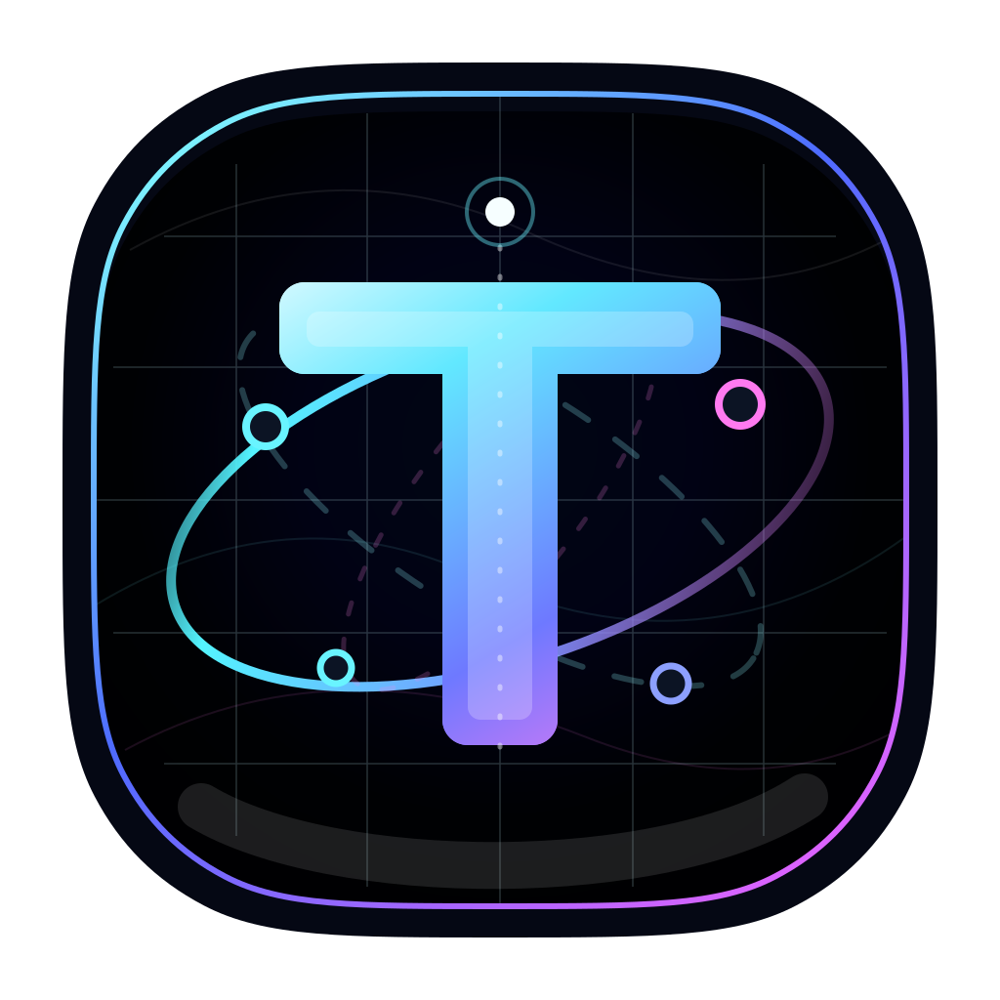

<p align="center">
  
</p>

# Telegraph

Telegraph is an Electron + React + Vite desktop workspace for exploring multi-process AI app architecture. It is built as a pnpm monorepo with a main Electron app, pagelet-style feature apps, shared UI packages, and runtime contracts that keep agent events and cross-process boundaries explicit.

## What It Is

- **Desktop shell:** `apps/main` owns Electron startup, window lifecycle, preload, and renderer mounting.
- **Pagelet apps:** `apps/design`, `apps/chat`, `apps/monitor`, `apps/setting`, `apps/connection`, and `apps/daemon` model feature/runtime surfaces as separate workspace apps.
- **Shared packages:** `packages/ui`, `packages/services`, `packages/runtime-contracts`, `packages/stores`, and `packages/agent` keep UI, service contracts, agent protocol, state, and runtime foundations reusable.
- **Architecture-first IPC:** cross-process behavior is routed through the orchestrator/RPC service shape documented in `AGENTS.md` and the project wiki.

## Quick Start

```bash
pnpm install
pnpm start
```

Useful checks:

```bash
pnpm typecheck
pnpm lint
pnpm test
```

## Project Map

```text
apps/        Electron runtime apps and feature pagelets
packages/    Shared UI, contracts, services, stores, and agent code
skills/      Project-local Codex skills and conventions
codebase-wiki/ Architecture notes, roadmaps, decisions, and references
docs/assets/ Project documentation artwork and static assets
```
