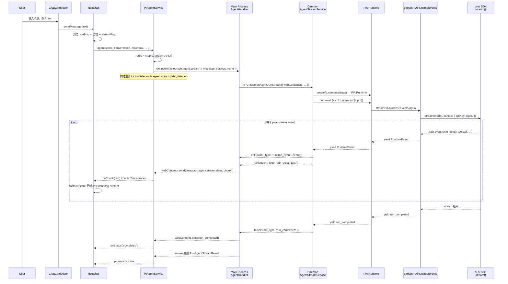

# Chat 消息到 LLM 数据流（当前架构）

> 本文档描述 2026-05-05 清理旧 `backends/` 与 `runPiCliStream` 后的实际活跃数据流。
> 所有旧路径（`createAgentBackend`、`PiCliBackend`、`PiAiBackend`、`BaseHarness`、`PiAgent`、`runPiCliStream`）已被移除。

## 1. 总览

用户在 ChatPanel 输入消息后，请求经过五层：

```
Renderer (React)
  → Main Process (Electron ipcMain)
    → Daemon Utility Process (RPC)
      → Runtime Adapter (in-process)
        → LLM Provider (pi-ai SDK)
```

响应通过独立的事件通道回流：

```
LLM Provider → Runtime (RuntimeEvent stream)
  → Daemon (sink.push)
    → Main (webContents.send)
      → Renderer (ipc.on listener)
```

请求与响应**不共用同一 IPC 通道**，避免 I-002 中记录的 invoke/push 互等死锁。

## 2. 数据流逐层详解

### 2.1 Renderer：用户输入与 IPC 发起

**触发入口**

```
ChatComposer.handleSend()                    packages/ui/src/components/chat/ChatComposer.tsx:53
  → ChatPanel.handleSendMessage(text)        packages/ui/src/components/chat/ChatPanel.tsx:160
    → useChat.sendMessage(text)              packages/ui/src/components/chat/use-chat.ts:103
```

`useChat` hook 内部流程（`use-chat.ts:114-223`）：

1. 构造 `userMsg`（role=user）和占位 `assistantMsg`（status=streaming）。
2. 将 user message 写入 zustand session store。
3. 创建 `AbortController` 用于取消。
4. 调用 `agentRef.current.send({...})`，传入 `conversation`、`signal`、`onChunk`、`onStatus`、`onLlmTrace` 回调。

**IPC 调用**

`PiAgentService.send()`（`pi-agent-service.ts:38`）：

1. 生成 `runId = crypto.randomUUID()`。
2. 注册 `ipc.on('telegraph:agent:stream:data', listener)` 监听流式事件。
3. 调用 `ipc.invoke('telegraph:agent:stream', { message, settings, runId, sessionId })`。
4. 等待 Promise 完成或超时（默认 150s，pi-subagents 可达 480s）。

### 2.2 Main Process：IPC 中转

`AgentHandler.setupAgentHandler()`（`apps/telegraph/src/services/agent/electron-main/AgentHandler.ts:25`）：

1. 创建到 daemon 的 RPC proxy（`ProxyRPCClient` on `agentStreamServicePath`）。
2. `ipcMain.handle('telegraph:agent:stream', ...)` 接收 renderer invoke。
3. 转发到 `daemonAgent.runStream({ webContentsId, runId, sessionId, message, settings })`。
4. 返回 `RunAgentStreamResult`（包含最终 status、text、error）。

Main process 本身**不做 LLM 调用**，仅做路由。

### 2.3 Daemon：RuntimeEvent 消费与分发

`AgentStreamService.runStreamInternal()`（`apps/telegraph/src/services/agent/node/AgentStreamService.ts:43`）：

```typescript
// 创建 runtime adapter
const runtime = createRuntime(req.settings)          // :162

// 消费 runtime 的 AsyncIterable<RuntimeEvent>
for await (const ev of runtime.run({                 // :168
  runId, sessionId, message, settings,
})) {
  handleRuntimeEvent(ev)                             // :174
}
```

`handleRuntimeEvent`（`:115-151`）统一处理所有 `RuntimeEvent`：

| 事件类型 | 处理动作 |
|----------|----------|
| 任意 RuntimeEvent | `safePush({ type: 'runtime_event', event })` 推送到 renderer |
| 任意 RuntimeEvent | 通过 `legacyLlmTraceFromRuntimeEvent` 转换为旧 `llm_trace` 格式（向后兼容） |
| `assistant_delta` | 追加 `textBuffer`，`push({ type: 'text_delta', text })` |
| `run_failed` | `push({ type: 'run_failed' })` + `push({ type: 'error' })` |
| `run_completed` | `flushPush({ type: 'run_completed' })` + `flushPush({ type: 'done' })` |

关键设计：

- 非关键事件用 `safePush`（fire-and-forget），不阻塞 runtime 消费。
- 关键生命周期事件（`run_completed`）用 `flushPush`（await），确保不丢失。
- `RunLifecycleManager` 确保终态事件不重复（`:117-118`）。

### 2.4 Runtime Adapter：统一接口

`createRuntime()`（`packages/agent/src/runtime/createRuntime.ts:27`）根据 `settings.backend` 选择 runtime：

| backend | Runtime 类 | 状态 |
|---------|-----------|------|
| `pi-ai`（默认） | `PiAiRuntime` | 生产可用 |
| `pi-embedded` | `PiEmbeddedRuntime` | 开发中 |
| `langgraph` | `LangGraphRuntime` | 骨架 |
| `vercel-ai` | `VercelAiRuntime` | 骨架 |

所有 runtime 实现 `RuntimeExecutor` 接口（继承自 `BaseAgentRuntime`）：

```typescript
interface RuntimeExecutor {
  readonly id: string
  run(input: RuntimeInput): AsyncIterable<RuntimeEvent>
}
```

### 2.5 PiAiRuntime：默认 LLM 调用路径

`PiAiRuntime.run()`（`packages/agent/src/runtime/PiAiRuntime.ts:24`）：

1. yield `run_started` 事件。
2. 委托给 `streamPiAiRuntimeEvents()` 获取 `AsyncGenerator<RuntimeEvent>`。
3. 逐个 yield 事件，遇到 `run_completed` 或 `run_failed` 时 break。

### 2.6 streamPiAiRuntimeEvents：pi-ai SDK 调用

`streamPiAiRuntimeEvents()`（`packages/agent/src/runtime/streamPiAiRuntime.ts:20`）：

```typescript
const model = resolveModel(settings)                 // :31
const context: Context = {                           // :32-36
  systemPrompt: 'You are a helpful assistant.',
  messages: [{ role: 'user', content: message }],
  tools: [],
}

// ★ 实际 LLM 调用
const s = stream(model, context, { apiKey, signal }) // :52
```

事件映射：

| pi-ai stream event | 产出的 RuntimeEvent |
|--------------------|---------------------|
| `text_delta` | `assistant_delta` (with `.text`) |
| `thinking_delta` | `runtime_log` |
| `toolcall_start` | `tool_call` |
| `toolcall_end` | `tool_result` |
| `error` | `run_failed` |
| stream 结束 | 调用 `s.result()` 获取最终 `Message`，yield `run_completed` |

每个事件都携带 `schemaVersion`、`producerVersion`、`runId`、`requestId`、`ts`。

## 3. 事件流序列图



## 4. IPC 通道总览

| 通道 | 方向 | 传输方式 | 用途 |
|------|------|----------|------|
| `telegraph:agent:stream` | renderer → main | `ipcRenderer.invoke` | 发起 run 请求，返回最终结果 |
| `telegraph:agent:stream:data` | main → renderer | `webContents.send` | 流式事件推送（text_delta、runtime_event、llm_trace 等） |
| `agentStreamServicePath` (RPC) | main → daemon | `@x-oasis/async-call-rpc` | main 转发 run 请求到 daemon |
| `agentStreamSinkServicePath` (RPC) | daemon → main | `@x-oasis/async-call-rpc` | daemon 推送 chunk 回 main |

## 5. 关键类型

### RuntimeEvent（核心协议）

定义于 `packages/runtime-contracts/`，所有 runtime adapter 产出的统一事件类型。当前活跃的事件类型：

- `run_started` / `run_completed` / `run_failed` — 生命周期
- `model_request` — 发送给 LLM 的完整 context（含 systemPrompt、messages、tools）
- `model_event` — LLM 原始流事件
- `assistant_delta` — 助手文本增量
- `tool_call` / `tool_result` — 工具调用与返回
- `runtime_log` — 调试日志（如 thinking delta）

### Renderer 接收的 chunk 类型

`PiAgentService` listener 处理的 `data.type`：

| type | 含义 | 回调 |
|------|------|------|
| `run_queued` | run 已排队 | `onStatus('queued')` |
| `run_started` | run 开始执行 | `onStatus('running')` |
| `text_delta` | 文本增量 | `onChunk(text)` |
| `run_completed` / `done` | run 完成 | `onStatus('completed')` |
| `run_failed` / `error` | run 失败 | `onStatus('failed')` |
| `llm_trace` | LLM trace 数据 | `onLlmTrace(trace)` |
| `runtime_event` | 结构化 RuntimeEvent | `onLlmTrace({ kind: 'runtime_event', event })` |

## 6. 已清理的旧路径

以下文件已于 2026-05-05 移除，不再是活跃数据流的一部分：

| 文件 | 旧职责 |
|------|--------|
| `packages/agent/src/backends/createAgentBackend.ts` | 旧 backend 工厂，已被 `runtime/createRuntime.ts` 取代 |
| `packages/agent/src/backends/PiAiBackend.ts` | 旧 pi-ai 后端类，已被 `PiAiRuntime` 取代 |
| `packages/agent/src/backends/PiCliBackend.ts` | pi-cli 后端存根（未实现） |
| `packages/agent/src/PiAgent.ts` | PiAiBackend 的别名包装 |
| `packages/agent/src/harness/BaseHarness.ts` | 测试 harness，无外部消费者 |
| `packages/agent/src/harness/index.ts` | harness re-export |
| `apps/telegraph/src/services/agent/node/runPiCliStream.ts` | 通过 spawn pi CLI 进程执行 LLM 调用，已被 in-process runtime 取代 |

## 7. 与 A-005 架构理论的对应

| A-005 目标 | 当前实现状态 |
|------------|------------|
| `AgentRuntime.run() → AsyncIterable<RuntimeEvent>` | `PiAiRuntime` 已实现 |
| `createRuntime(settings)` 工厂 | `runtime/createRuntime.ts` 已实现 |
| `RuntimeEvent` 统一事件协议 | `packages/runtime-contracts` 已定义并在用 |
| Trace 从 RuntimeEvent 投影 | daemon 通过 `runtime_event` chunk 推送到 renderer，TracePanel 消费 |
| PiCliRuntime 作为 fallback | 已移除，不再保留 |
| PiEmbeddedRuntime（带 tool loop） | 骨架已存在，待完善 |
| Extension Host / Tool Registry | 骨架存在，尚未接入主流程 |
