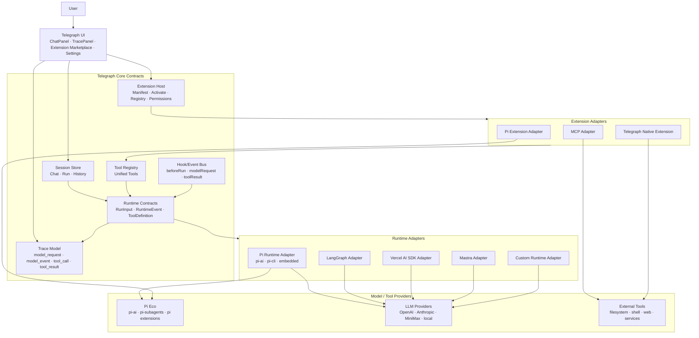
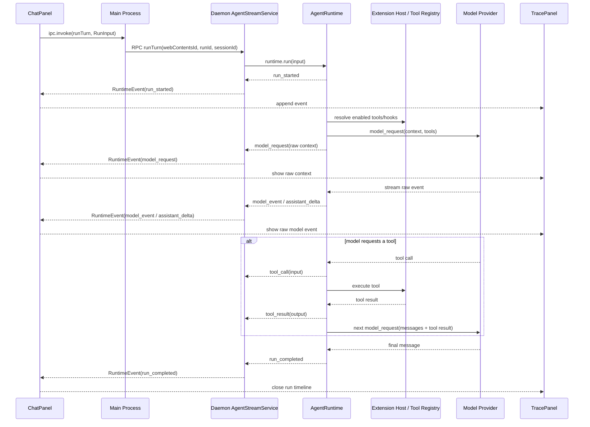
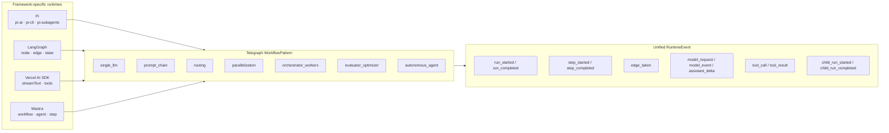
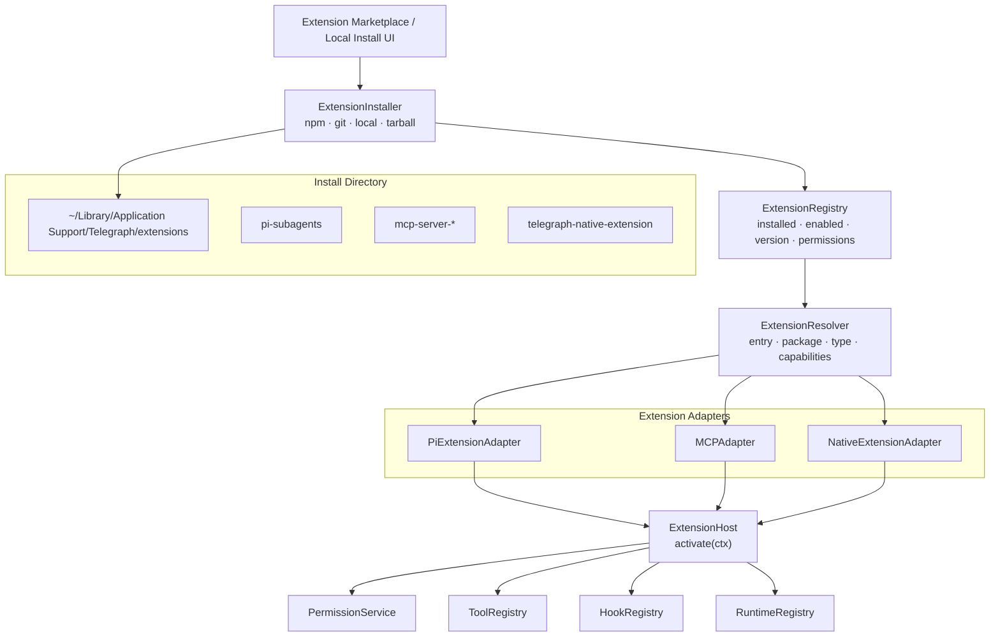
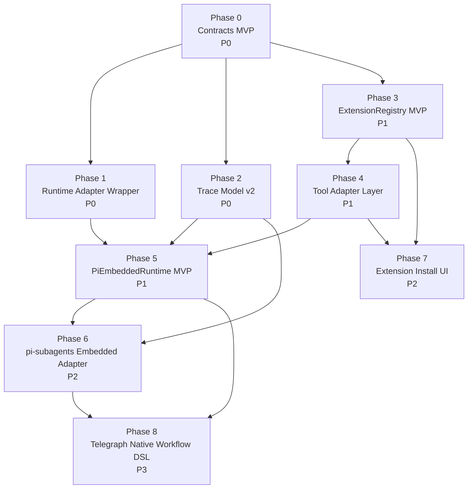

# Telegraph Agent Runtime 与 Extension Host 理论基础

> 本文沉淀一次围绕 Telegraph 未来定位的架构讨论：Telegraph 不应只是 Pi CLI 的 UI 包装，而应成为一个通用 **agent runtime host / extension host**。Pi 是第一套重点接入的生态，但核心抽象应保持框架无关，从而在未来接入 LangGraph、Vercel AI SDK、Mastra、OpenAI Agents SDK、MCP 或自研 runtime 时不需要推倒 ChatPanel、Trace、Session 与 Extension 管理体系。

## 来源

- [Anthropic Engineering - Building effective agents](https://www.anthropic.com/engineering/building-effective-agents)

## 1. 核心结论

### 1.1 Telegraph 的产品定位

当前讨论形成的目标定位是：

> Telegraph 是一个 **可视化、可安装、可调试、可组合的本地 agent 工作台**，而不是单一 agent framework 的壳。

这意味着 Telegraph 自身需要掌握以下通用能力：

- 会话与消息管理：多 chat、多 run、历史持久化。
- Runtime 抽象：屏蔽 Pi / LangGraph / AI SDK / Mastra 等底层差异。
- Extension 管理：安装、启用、禁用、更新、权限提示与能力发现。
- Tool Registry：把不同来源的工具统一注册给 runtime。
- Hook/Event 体系：让 extension 参与 run 生命周期、消息处理、工具执行和 UI 扩展。
- Trace / Observability：展示发给模型的原始 request、模型返回的原始 event、tool call、tool result、workflow step。
- Permission / Sandbox：控制 extension 对文件、进程、网络、shell、workspace 的访问。

### 1.2 Pi 是第一生态，但不是架构天花板

Pi 当前是 Telegraph 的首要 agent 生态，原因是：

- 已有 `pi-ai` 路径可以进程内调用模型。
- `pi-cli` 路径可以加载 Pi extension，例如 `pi-subagents`。
- Pi extension/subagent 生态与 Telegraph 的本地 agent 工作台方向契合。

但 Telegraph 核心协议不应命名为 `PiEvent`、`PiExtension`、`PiWorkflow`。更合理的命名是：

- `AgentRuntime`
- `RuntimeEvent`
- `ToolDefinition`
- `ExtensionManifest`
- `ExtensionContext`
- `WorkflowPattern`
- `TraceEvent`

Pi 的原始事件与概念可以保存在 `origin` / `raw` 字段中，而不是污染核心类型。

### 1.3 不要长期依赖 spawn CLI

当前 `pi-cli` 路径的优势是能力完整：它可以通过 `--extension` 加载 Pi extension，并由 Pi CLI runtime 自己处理 extension loading、tool registration、tool loop、subagent execution 与 JSON event stream。

但是从宿主应用角度看，长期依赖 `spawn("pi", args)` 有明显问题：

- 生命周期被外部进程隔开，取消、暂停、恢复、错误分类更复杂。
- 原始 trace 需要解析 stdout JSON，事件时序与 IPC 回压容易出问题。
- 打包与路径解析复杂，尤其是 asar、用户目录、全局安装、项目内依赖混合时。
- 安全与权限控制粒度较粗，extension 的工具能力很难在 Telegraph 内统一审计。
- UI 只能被动消费 CLI 输出，不容易实现一等的 tool call inspection、step timeline、human checkpoint。

因此建议：

- 短期保留 `PiCliRuntime` 作为 compatibility runtime。
- 中长期建设 `PiEmbeddedRuntime` 或更通用的 `EmbeddedRuntimeHost`。
- 如果 Pi 官方未来提供 embeddable runtime API，优先接官方；否则 Telegraph 自己实现最小 runtime host：extension loading + tool adapter + tool loop + pi-ai stream。

## 2. 总体架构图

本节用几张图把长期目标、事件流、extension 安装与 runtime 适配关系压成可评审的结构。图中的 `Telegraph Core Contracts` 是最关键的稳定层：它不应该知道 Pi、LangGraph、AI SDK、Mastra 的内部类型，只接收 adapter 归一化后的事件和能力。

### 2.1 Telegraph 作为通用 Agent Host



关键含义：

- UI 永远面对 Telegraph 的 `RuntimeEvent` 和 `Trace Model`，不直接解析 Pi JSON、LangGraph node event 或 AI SDK stream part。
- Runtime adapter 负责把底层框架事件映射到 Telegraph 事件。
- Extension adapter 负责把不同来源的扩展能力映射到 Telegraph `ToolDefinition` / `Hook` / `Command`。
- Tool Registry 是模型与 extension 之间的 agent-computer interface。

### 2.2 一次 Run 的事件流



设计重点：

- `model_request` 必须展示真实发送给模型的数据，例如当前 `PiAiBackend` 中构造出的 `Context`。
- `model_event` 必须保留底层 raw event，用于判断 provider、SDK 或 adapter 的真实行为。
- `tool_call` / `tool_result` 是后续 extension 生态的可观测核心。
- Trace 事件通道不应和 `runTurn` request/response 形成互等，否则会重现 I-002 一类 deadlock。

### 2.3 Runtime Adapter 与 Workflow Pattern 映射



这里的重点是：Telegraph 统一的是运行时事实，不是底层编排 DSL。LangGraph 的 node/edge、AI SDK 的 chain、Mastra 的 workflow step、Pi subagents 的 chain/parallel 都先映射到 `RuntimeEvent`，未来如果要做 Telegraph Native Workflow DSL，再考虑 compile 到不同后端。

### 2.4 Extension 安装、解析与加载



这个图表达一个重要判断：即便第一批 extension 来自 Pi，Telegraph 也应维护自己的 registry 和 install directory。这样后续接 MCP 或 Telegraph native extension 时，不会被 `~/.pi` 的目录结构和 CLI 行为锁死。

## 3. 从 Anthropic 的 agentic system 分类得到的启发

Anthropic 在《Building effective agents》中强调：成功系统通常使用简单、可组合的模式，而不是一开始堆复杂框架。它把 agentic systems 区分为两类：

- **Workflows**：LLM 与工具通过预定义代码路径编排。
- **Agents**：LLM 动态决定自己的过程和工具使用方式。

这个区分对 Telegraph 很重要。

### 3.1 Workflow 与 Agent 不应该被混成一个 DSL

不同框架对 workflow 的定义差异很大：

| 框架 / 生态 | 常见抽象 | 适配风险 |
|-------------|----------|----------|
| LangGraph | graph、node、edge、state、checkpoint | 如果 Telegraph 核心直接采用 graph，会天然偏向 LangGraph |
| Vercel AI SDK | `streamText`、tool calling、chain-like composition | 如果硬塞成 graph，会增加无意义结构 |
| Mastra | agent、workflow、step、tool | 与 productized workflow 接近，但仍有自身 DSL |
| Pi / pi-subagents | extension、tool、subagent、chain、parallel | 核心在工具委派与扩展加载，不是通用 graph DSL |
| 普通 chat | single LLM call | 不需要 workflow |

因此 Telegraph 不应首先定义：

```typescript
interface Workflow {
  nodes: Node[]
  edges: Edge[]
}
```

更稳妥的是先定义：

```typescript
interface AgentRuntime {
  run(input: RunInput): AsyncIterable<RuntimeEvent>
}
```

Telegraph 先关心 **一次 run 期间发生了什么**，而不是底层到底用 graph、chain、state machine 还是 autonomous loop 编排。

### 3.2 Anthropic 常见模式映射到 Telegraph

Anthropic 文章列出几类常见模式。Telegraph 可以把它们抽象成 `WorkflowPattern` metadata，而不是要求所有 runtime 共享同一个 DSL。

```typescript
export type WorkflowPattern =
  | 'single_llm'
  | 'prompt_chain'
  | 'routing'
  | 'parallelization'
  | 'orchestrator_workers'
  | 'evaluator_optimizer'
  | 'autonomous_agent'
```

对应解释：

| Pattern | 含义 | Telegraph 表达 |
|---------|------|----------------|
| `single_llm` | 单次 LLM 调用，可能带 retrieval/tools/memory | 一个 `model_request` + 多个 `model_event` + `run_completed` |
| `prompt_chain` | 固定顺序拆解任务，前一步输出给下一步 | 多个 `step_started` / `step_completed`，每步可包含 `model_request` |
| `routing` | 先分类，再进入不同路径 | router step + `edge_taken` |
| `parallelization` | 多个独立分支并行执行，再聚合 | 多个并发 step / child run + aggregation step |
| `orchestrator_workers` | orchestrator 动态拆任务给 workers | orchestrator step + 动态 worker child runs |
| `evaluator_optimizer` | 生成器与评估器循环迭代 | repeated generate/evaluate steps |
| `autonomous_agent` | 模型自主循环使用工具和环境反馈 | model/tool loop，直到停止条件满足 |

这套 pattern 是可视化、trace 与评估维度，不是底层强制实现方式。

## 4. Telegraph 的核心抽象层

建议将 Telegraph 的长期核心拆为以下几层：

```text
Telegraph UI
  ChatPanel / TracePanel / Extension Marketplace / Settings

Telegraph Core Contracts
  Runtime / Event / Tool / Extension / Hook / Permission / Session

Runtime Adapters
  PiRuntimeAdapter / LangGraphRuntimeAdapter / AiSdkRuntimeAdapter / MastraRuntimeAdapter

Extension Adapters
  PiExtensionAdapter / MCPAdapter / TelegraphNativeExtensionAdapter

Model Providers
  pi-ai / OpenAI / Anthropic / MiniMax / Vercel AI SDK providers / custom
```

### 4.1 Run 是第一概念

`Run` 表示一次可观测、可取消、可持久化的 agent 执行。

```typescript
export interface RunInput {
  runId: string
  sessionId: string
  messages: RuntimeMessage[]
  runtime: RuntimeSelection
  enabledExtensions: string[]
  metadata?: Record<string, unknown>
  signal?: AbortSignal
}

export interface AgentRuntime {
  readonly id: string
  readonly label: string
  run(input: RunInput): AsyncIterable<RuntimeEvent>
}
```

Run 的好处：

- ChatPanel 不需要知道底层是 Pi、LangGraph 还是 AI SDK。
- TracePanel 只消费事件流。
- Session store 只持久化消息与 run summary。
- Extension manager 只决定哪些 extension 在 run 中启用。
- 后续支持后台任务、重试、恢复、并发控制时有统一实体。

### 4.2 RuntimeEvent 是统一观测协议

Telegraph 不应先统一 workflow DSL，而应统一 runtime events。

```typescript
export type RuntimeEvent =
  | RunLifecycleEvent
  | ModelEvent
  | ToolEvent
  | WorkflowEvent
  | ExtensionEvent
  | HumanInteractionEvent
  | RuntimeLogEvent

export type RunLifecycleEvent =
  | { type: 'run_started'; runId: string; pattern?: WorkflowPattern; ts: number }
  | { type: 'run_completed'; runId: string; output: unknown; raw?: unknown; ts: number }
  | { type: 'run_failed'; runId: string; error: RuntimeError; raw?: unknown; ts: number }
  | { type: 'run_cancelled'; runId: string; reason?: string; ts: number }

export type ModelEvent =
  | { type: 'model_request'; requestId: string; payload: unknown; raw?: unknown; ts: number }
  | { type: 'model_event'; requestId: string; raw: unknown; ts: number }
  | { type: 'assistant_delta'; requestId: string; text: string; raw?: unknown; ts: number }
  | { type: 'assistant_message'; requestId: string; message: RuntimeMessage; raw?: unknown; ts: number }

export type ToolEvent =
  | { type: 'tool_call'; callId: string; toolName: string; input: unknown; raw?: unknown; ts: number }
  | { type: 'tool_result'; callId: string; toolName: string; output: unknown; raw?: unknown; ts: number }
  | { type: 'tool_error'; callId: string; toolName: string; error: RuntimeError; raw?: unknown; ts: number }

export type WorkflowEvent =
  | { type: 'step_started'; stepId: string; label: string; kind?: StepKind; raw?: unknown; ts: number }
  | { type: 'step_completed'; stepId: string; output?: unknown; raw?: unknown; ts: number }
  | { type: 'edge_taken'; from: string; to: string; condition?: string; raw?: unknown; ts: number }
  | { type: 'child_run_started'; parentRunId: string; childRunId: string; label?: string; ts: number }
  | { type: 'child_run_completed'; parentRunId: string; childRunId: string; output?: unknown; ts: number }

export type StepKind =
  | 'model'
  | 'tool'
  | 'router'
  | 'worker'
  | 'evaluator'
  | 'aggregator'
  | 'custom'
```

每个事件建议保留：

- `type`：稳定协议名。
- `runId` 或可关联字段：用于归属。
- `ts`：事件时间。
- `raw`：底层框架原始数据。
- `origin`（可选）：框架来源。

```typescript
export interface RuntimeOrigin {
  framework: 'pi' | 'langgraph' | 'ai-sdk' | 'mastra' | 'telegraph' | 'custom'
  runtimeId?: string
  raw?: unknown
}
```

#### 4.2.1 RuntimeEvent 契约版本与兼容策略

为了让 `RuntimeEvent` 真正成为长期稳定层，建议在 contracts 层同步定义版本治理规则：

- 事件载荷包含 `schemaVersion`（协议版本）与 `producerVersion`（runtime adapter 版本）。
- `schemaVersion` 仅在破坏性变更时升级主版本；新增字段/新增事件类型默认视为向后兼容。
- Renderer 与 extension 对未知事件类型必须采用降级策略（显示 `runtime_log` + raw），而不是直接抛错。
- 事件类型的弃用采用双周期策略：`deprecated` 标记一个版本，下一主版本移除。

建议兼容等级：

| 状态 | 含义 |
|------|------|
| supported | 官方保证行为与语义稳定 |
| best-effort | 尽力适配，不承诺全部语义 |
| deprecated | 可运行但已进入移除窗口 |
| unsupported | 不再保证可运行 |

建议在 roadmap 中维护一张兼容矩阵：`Telegraph version x Runtime contract version x Pi ecosystem version`，并明确何时 fallback `PiCliRuntime`、何时 fail-fast。

### 4.3 Trace 是协议的一部分，不是 console.log

右侧 LLM Trace 不应只是调试 UI。它应该成为 runtime protocol 的一等投影。

最低要求：

- 展示发给模型的原始 `context` / request body。
- 展示模型流式返回的 raw event。
- 展示 tool call 输入。
- 展示 tool result 输出。
- 展示 tool result 追加后下一次 model request 的 context。
- 展示 workflow step、routing edge、parallel child run、evaluator feedback。

这能避免“框架层把 prompt 和 response 藏起来”的问题，也呼应 Anthropic 对透明性的建议。

### 4.4 Tool 是 extension 与 model 之间的 agent-computer interface

Anthropic 文章强调工具接口需要像 HCI 一样认真设计。对 Telegraph 来说，Tool 是 extension 能力暴露给模型的最小单位。

```typescript
export interface ToolDefinition {
  name: string
  title?: string
  description: string
  inputSchema: unknown
  outputSchema?: unknown
  permissions?: PermissionRequest[]
  examples?: ToolExample[]
  execute(input: unknown, ctx: ToolExecutionContext): Promise<ToolResult>
  metadata?: {
    provider?: 'pi' | 'mcp' | 'telegraph' | 'custom'
    sourceExtensionId?: string
    raw?: unknown
  }
}

export interface ToolExecutionContext {
  runId: string
  sessionId: string
  workspaceRoot?: string
  emit(event: RuntimeEvent): void | Promise<void>
  readResource?(uri: string): Promise<unknown>
  requestPermission?(permission: PermissionRequest): Promise<boolean>
}

export interface ToolResult {
  content: unknown
  display?: unknown
  raw?: unknown
}
```

设计原则：

- 工具名与参数名要清楚，避免模型误用。
- 输入 schema 应尽量接近模型自然会写的格式。
- 对危险能力显式声明权限。
- 工具返回结果应同时包含 machine-readable 与 UI-display 形态。
- 原始 provider 数据保存在 `raw`，不要丢失。

### 4.5 Extension 不直接改 UI，而是注册能力

Extension 是 Telegraph 扩展生态的安装单位。它可以提供 tools、commands、hooks、panels、runtime adapter、model provider，但不应该直接随意改全局状态。

```typescript
export interface TelegraphExtension {
  manifest: ExtensionManifest
  activate(ctx: ExtensionContext): Promise<void> | void
  deactivate?(): Promise<void> | void
}

export interface ExtensionManifest {
  id: string
  name: string
  version: string
  description?: string
  source?: ExtensionSource
  entry: string
  capabilities: ExtensionCapability[]
  permissions: PermissionRequest[]
  contributes?: {
    tools?: ToolContribution[]
    commands?: CommandContribution[]
    panels?: PanelContribution[]
    runtimes?: RuntimeContribution[]
    hooks?: HookContribution[]
  }
}

export interface ExtensionContext {
  extensionId: string
  extensionPath: string
  subscriptions: Disposable[]
  tools: ToolRegistry
  commands: CommandRegistry
  hooks: HookRegistry
  runtimes: RuntimeRegistry
  storage: ExtensionStorage
  logger: ExtensionLogger
}
```

这套接口让 Telegraph 可以同时容纳：

- Pi extension：通过 adapter 读取 Pi extension manifest / entry，并转为 Telegraph tools/hooks。
- MCP server：把 MCP tools 转为 Telegraph `ToolDefinition`。
- Telegraph native extension：直接实现 `activate(ctx)`。
- Runtime plugin：注册新的 `AgentRuntime`，例如 LangGraphRuntime 或 MastraRuntime。

### 4.6 Hook 是跨 extension 的生命周期扩展点

Hooks 解决“extension 如何参与 run 生命周期”的问题。

```typescript
export type HookName =
  | 'beforeRun'
  | 'afterRun'
  | 'beforeModelRequest'
  | 'afterModelEvent'
  | 'beforeToolCall'
  | 'afterToolResult'
  | 'onRuntimeEvent'
  | 'onMessageCommitted'

export interface HookRegistry {
  register<T extends HookName>(name: T, handler: HookHandler<T>): Disposable
}
```

Hook 需要注意：

- 默认不应阻塞关键流式路径，除非 hook 明确声明 `blocking: true`。
- 所有 hook 都应有 timeout 与错误隔离。
- Hook 产生的事件应进入 trace，便于调试 extension 副作用。
- 权限敏感 hook 需要用户授权，例如读写 workspace、执行 shell。

## 5. Pi 生态的两条路径

### 5.1 PiCliRuntime：兼容路径

当前 `pi-cli` 路径本质是：

```text
Telegraph daemon
  -> spawn pi -p --mode json --extension <path>
  -> read stdout JSON
  -> map to UI chunks and trace rows
```

优点：

- 能立即使用 Pi CLI 已有 extension loader。
- 能跑 `pi-subagents` 的 chain / parallel / async / subagent tool。
- 与 Pi 生态官方 CLI 行为一致，接入成本低。

缺点：

- `spawn` 生命周期复杂。
- stdout JSON 解析是旁路协议。
- 无法在 Telegraph 内部细粒度掌握 tool registry 与 permissions。
- Trace 与 UI 事件容易受 IPC/RPC backpressure 影响；I-002 记录过相关死锁问题。
- 打包、全局安装、asar materialize、用户目录 discovery 都会增加复杂度。

因此它适合作为 compatibility runtime，而不是最终主线。

### 5.2 PiEmbeddedRuntime：主线目标

理想结构：

```text
Telegraph daemon process
  -> PiEmbeddedRuntime
    -> load enabled Pi extensions
    -> adapt extension tools to ToolDefinition
    -> build pi-ai Context
    -> stream(model, context)
    -> receive tool calls
    -> execute tools
    -> append tool results
    -> continue stream
    -> emit RuntimeEvent
```

这需要补齐四件事：

1. **Extension loader**：找到已安装 extension，加载 entry，读取 manifest / exports。
2. **Tool adapter**：把 Pi extension tool 格式转成 Telegraph `ToolDefinition`，再转成 `@mariozechner/pi-ai` 所需 `Tool[]`。
3. **Tool loop**：模型返回 tool call 后执行工具，把结果追加回 messages，继续调用模型。
4. **Event bridge**：把 `pi-ai` stream event、tool event、extension event 统一转成 `RuntimeEvent`。

这不是简单“让 pi-ai 自动读 extension”。更准确地说：

- `pi-ai` 是模型 streaming / tool calling SDK。
- Pi CLI 是完整 agent runtime。
- Telegraph 需要的是 embeddable runtime。
- 如果 Pi 没有提供官方 embeddable runtime，Telegraph 就自己实现 runtime host，底层仍可使用 `pi-ai`。

## 6. Workflow 抽象：统一运行观察，不统一编排 DSL

### 6.1 为什么不要先做 Telegraph Workflow DSL

如果 Telegraph 过早定义自己的 graph / node / edge DSL，会遇到两个问题：

1. 它会偏向某个框架，例如 LangGraph。
2. 它会把简单 chain、单次 chat、Pi subagent、Mastra workflow 都硬塞进同一结构。

这会让 adapter 变成“语义损失转换器”。

### 6.2 更合理的分层

建议分两层：

```text
第一层：Runtime Event Protocol
  统一运行时发生了什么，用于 trace、timeline、debug、persistence。

第二层：Telegraph Native Workflow DSL（未来可选）
  如果 Telegraph 将来要提供可视化编排器，再定义自己的 DSL。
  它可以 compile 到 LangGraph / AI SDK chain / Mastra / Telegraph native runtime。
```

第一阶段只做运行观测，不做编排统一。

### 6.3 Adapter 映射示例

#### LangGraph

```text
LangGraph node start      -> step_started(kind: 'custom' | 'model' | 'tool')
LangGraph edge transition -> edge_taken
LLM node request          -> model_request
Tool node result          -> tool_result
Checkpoint                -> runtime_log / step_completed metadata
```

#### Vercel AI SDK

```text
streamText request        -> model_request
text delta                -> assistant_delta
toolCall event            -> tool_call
toolResult                -> tool_result
finish                    -> run_completed
```

#### Mastra

```text
workflow step start       -> step_started
agent model call          -> model_request / model_event
tool execution            -> tool_call / tool_result
workflow step finish      -> step_completed
```

#### Pi CLI

```text
pi_cli_request            -> model_request / runtime_log
pi_json_line message_*    -> model_event / assistant_delta
tool_execution_start      -> tool_call
tool_execution_end        -> tool_result
agent_end                 -> run_completed
```

#### Pi Embedded

```text
pi-ai Context             -> model_request
pi-ai stream event        -> model_event / assistant_delta
pi-ai toolcall_start      -> tool_call
tool adapter output       -> tool_result
final Message             -> run_completed
```

## 7. Extension 安装与管理模型

用户的长期预期是：在 Telegraph 中点击安装 Pi extension，并增强 Telegraph 能力。

这要求 Telegraph 拥有自己的 extension registry，而不是完全依赖全局 `~/.pi`。

### 7.1 ExtensionRegistry

建议 manifest 存储形态：

```json
{
  "id": "pi-subagents",
  "source": "npm:pi-subagents",
  "version": "0.24.0",
  "entry": "index.ts",
  "enabled": true,
  "capabilities": ["tools", "subagents"],
  "installPath": "/Users/me/Library/Application Support/Telegraph/extensions/pi-subagents",
  "permissions": ["filesystem", "process"]
}
```

职责：

- 记录已安装 extension。
- 记录启用/禁用状态。
- 记录 source 与版本。
- 记录 permissions 与能力声明。
- 支持更新、卸载、迁移。

### 7.2 ExtensionInstaller

支持来源：

- `npm:<package>`
- GitHub repo
- local directory
- tarball
- marketplace registry

安装目录建议：

```text
~/Library/Application Support/Telegraph/extensions/
```

开发期也可使用：

```text
~/.telegraph/extensions/
```

不要把 extension 安装进应用源码树，避免污染 workspace 和打包产物。

### 7.3 ExtensionResolver

Resolver 负责：

- 找 entry 文件。
- 读取 package manifest。
- 识别 Pi extension、MCP server、Telegraph native extension。
- 处理 asar / unpacked / global / project-local 等路径差异。
- 给 runtime 返回可加载的 normalized extension descriptor。

### 7.4 Permission 模型

即使第一阶段不做强权限，也要在类型中占位。

```typescript
export type PermissionRequest =
  | { type: 'filesystem'; scope: 'workspace' | 'user-selected' | 'home' | 'any'; access: 'read' | 'write' | 'readwrite' }
  | { type: 'process'; commands?: string[] }
  | { type: 'network'; hosts?: string[] }
  | { type: 'shell'; risk: 'low' | 'medium' | 'high' }
  | { type: 'secrets'; keys?: string[] }
```

这样将来 extension marketplace 才能展示：

```text
This extension wants to:
- read workspace files
- execute pi subagents
- access network
```

## 8. 与当前 Telegraph 代码的关系

### 8.1 当前入口链路

当前 chat 到模型的大致链路：

```text
packages/ui/src/components/chat/use-chat.ts
  -> PiAgentService.send()
  -> ipc.invoke('telegraph:agent:stream')
  -> apps/telegraph/src/services/agent/electron-main/AgentHandler.ts
  -> daemon AgentStreamService.runStream()
  -> createAgentBackend(settings)
  -> PiAiBackend 或 runPiCliStream
```

这条链路现在把 backend 分支放在 `AgentStreamService.runStreamInternal` 内。

长期建议将它改为：

```text
AgentStreamService
  -> createRuntime(settings)
  -> runtime.run(input)
  -> for await RuntimeEvent
  -> fan out to renderer
```

### 8.2 现有 `pi-ai` trace 的意义

最近对 `pi-ai` trace 的修正方向是正确的：

- `PiAiBackend` 中真正构造出的 `Context` 应作为 `model_request` / `pi_ai_request` 展示。
- `stream()` 的 raw event 应作为 `model_event` 展示。
- 这能让右侧 TracePanel 看到真实发送给模型的数据，而不是 UI 层自己猜测的数据。

但这仍是局部 trace。下一阶段应将其升级为通用 `RuntimeEvent`。

### 8.3 与 I-002 的经验连接

I-002 说明：如果 trace 推送与主 RPC 生命周期没有清晰的事件通道边界，就会发生阻塞或丢事件。

因此 runtime event stream 需要：

- 明确 backpressure 策略。
- 关键事件与调试事件分级。
- 调试 trace 不能阻塞模型流消费，除非明确需要强一致。
- renderer listener 生命周期不能短于 run event 生命周期。
- main/daemon 之间不要形成 `invoke waiting runStream` 与 `sink.push waiting main` 的互等。

### 8.4 当前实现约束与迁移现实（建议显式记录）

为了避免“文档目标状态”被误读成“当前已实现状态”，建议补充以下现实约束：

- 当前 UI/IPC 主链路仍以 `AgentRunEvent` + `LlmTracePayload` 双通道为主，尚未统一为 `RuntimeEvent` 直通。
- 事件命名存在迁移期差异（例如 `text_delta` 与 `assistant_delta`），建议在 adapter 层维护兼容映射表。
- `pi-ai` 路径的 trace 回调若阻塞，会拖慢上游事件消费；调试事件默认应非阻塞并可降级丢弃。
- Phase 1/2 验收不能只看单轮请求，应增加多轮上下文一致性用例，确保“模型收到的上下文”与 Trace 展示一致。
- 对 `PiCliRuntime` 的 fallback 触发条件要可观测（在 trace 与日志里都给出原因），避免静默行为偏差。

## 9. 推荐包结构

建议新增一个 contracts 包，先沉淀类型，不急着把所有实现迁过去：

```text
packages/runtime-contracts/
  src/index.ts
  src/runtime.ts
  src/events.ts
  src/messages.ts
  src/tools.ts
  src/extensions.ts
  src/hooks.ts
  src/permissions.ts
  src/errors.ts
```

然后在 `packages/agent` 或新包里实现 runtime：

```text
packages/agent-runtime/
  src/createRuntime.ts
  src/pi/PiAiRuntime.ts
  src/pi/PiCliRuntime.ts
  src/pi/PiEmbeddedRuntime.ts
  src/langgraph/LangGraphRuntime.ts
  src/ai-sdk/AiSdkRuntime.ts
  src/mastra/MastraRuntime.ts
```

Electron app 侧：

```text
apps/telegraph/src/services/extensions/
  common/types.ts
  node/ExtensionRegistry.ts
  node/ExtensionInstaller.ts
  node/ExtensionResolver.ts
  electron-main/ExtensionHandler.ts

apps/telegraph/src/services/agent/
  common/runtime-events.ts
  node/RuntimeEventForwarder.ts
  node/AgentStreamService.ts
```

UI 侧：

```text
packages/ui/src/components/chat/
  LlmTracePanel.tsx
  RuntimeTimeline.tsx
  ToolCallInspector.tsx
  ExtensionBadge.tsx
```

## 10. 实现路径 Plan 与优先级判断

本节把前面的理论拆成实际工程路径。优先级判断遵循三个原则：

1. **先切稳定边界，再迁移实现**：先定义 contracts 与 adapter 边界，避免继续把分支堆在 `AgentStreamService`。
2. **先保障可观测性，再增加自治能力**：Trace 是后续 extension/tool/workflow 调试的地基，优先级高于 marketplace。
3. **先兼容现状，再替换底层**：`PiCliRuntime` 保留为 fallback，`PiEmbeddedRuntime` 渐进增强。

### 10.1 优先级总览

| 优先级 | 阶段 | 目标 | 为什么排在这里 |
|--------|------|------|----------------|
| P0 | Contracts MVP | 定义 `RunInput`、`RuntimeEvent`、`AgentRuntime`、`ToolDefinition`、`ExtensionManifest`、`PermissionRequest` | 这是所有后续迁移的稳定边界；成本低、收益高 |
| P0 | Runtime Adapter Wrapper | 把现有 `pi-ai` / `pi-cli` 包成 runtime adapter | 不改变用户行为，但清掉 `AgentStreamService` 的硬编码分支 |
| P0 | Trace Model v2 | 让 TracePanel 消费 `RuntimeEvent`，按 run 分组展示 raw model/tool/workflow 事件 | 没有透明 trace，后续 extension/tool loop 很难调试 |
| P1 | ExtensionRegistry MVP | 管理 installed/enabled/permissions/installPath | 为“点击安装 extension”打基础，但不急着做市场 |
| P1 | PiEmbeddedRuntime MVP | 不 spawn CLI，跑通 model -> tool -> model | 证明 embedded runtime 路线可行 |
| P1 | Tool Adapter Layer | 将 Pi/MCP/native tools 统一为 `ToolDefinition` | 这是 extension host 的核心能力 |
| P2 | pi-subagents Embedded Adapter | 将 `pi-subagents` chain/parallel 映射为 runtime events | 第一个复杂生态验证，价值高但依赖 P1 |
| P2 | Extension Install UI | 点击安装、启用、禁用、更新 | 需要 registry/resolver 权限模型先稳定 |
| P3 | Telegraph Native Workflow DSL | 可视化编排与 compile 到不同 runtime | 产品上很诱人，但过早做会锁死抽象 |

### 10.2 Phase 0：Contracts MVP（P0）

目标：新增最小 contracts，不改变行为。

建议文件：

```text
packages/runtime-contracts/
  src/index.ts
  src/runtime.ts
  src/events.ts
  src/messages.ts
  src/tools.ts
  src/extensions.ts
  src/permissions.ts
  src/errors.ts
```

关键接口：

```typescript
export interface AgentRuntime {
  readonly id: string
  run(input: RunInput): AsyncIterable<RuntimeEvent>
}

export interface RunInput {
  runId: string
  sessionId: string
  messages: RuntimeMessage[]
  settings: RuntimeSettings
  enabledExtensions?: string[]
  signal?: AbortSignal
}
```

验收：

- `packages/runtime-contracts` 可以独立 typecheck。
- 现有 `packages/agent` 与 `apps/telegraph` 可以导入这些类型。
- 不修改 ChatPanel 行为。

优先级判断：

- 这是最高优先级。没有 contracts，后面所有计划都会变成继续局部补丁。

### 10.3 Phase 1：Runtime Adapter Wrapper（P0）

目标：把现有两个路径包装成统一 runtime。

改造前：

```text
AgentStreamService.runStreamInternal
  if backend === 'pi-cli' -> runPiCliStream
  else -> agent.send / PiAiBackend
```

改造后：

```text
AgentStreamService.runStreamInternal
  runtime = createRuntime(settings)
  for await (event of runtime.run(input))
    forward(event)
```

建议实现：

```text
packages/agent-runtime/src/createRuntime.ts
packages/agent-runtime/src/pi/PiAiRuntime.ts
packages/agent-runtime/src/pi/PiCliRuntime.ts
```

事件映射：

| 现有事件 | RuntimeEvent |
|----------|--------------|
| `run_queued` | `run_started` 或 `runtime_log` |
| `pi_ai_request` | `model_request` |
| `pi_ai_stream_event` | `model_event` |
| `text_delta` | `assistant_delta` |
| `pi_cli_request` | `model_request` / `runtime_log` |
| `pi_json_line` | `model_event` / `tool_call` / `tool_result` / `run_completed` |

验收：

- 用户发送 chat 的行为不变。
- `pi-ai` 和 `pi-cli` 都仍可工作。
- `AgentStreamService` 不再直接写 backend 业务逻辑，只负责转发。

优先级判断：

- 这是第二优先级。它是一次“结构迁移”，风险可控，但能明显降低后续复杂度。

### 10.4 Phase 2：Trace Model v2（P0）

目标：把右侧 LLM trace 从“若干 debug row”升级为 run timeline。

建议 UI 结构：

```text
Run <runId>
  model_request #1
    raw context / request body
  model_event
    raw stream event
  assistant_delta
  tool_call
    input
  tool_result
    output
  model_request #2
    messages + tool result
  run_completed
```

数据结构：

```typescript
export interface TraceRun {
  runId: string
  sessionId: string
  startedAt: number
  completedAt?: number
  events: RuntimeEvent[]
}
```

验收：

- 每次 `pi-ai` 调用都能看到真实 `Context`。
- 模型原始 stream event 不会在 idle 后丢失。
- `pi-cli` raw JSON 仍可查看，但以 `RuntimeEvent` 分组。
- TracePanel 支持按类型过滤：model / tool / workflow / extension / error。

优先级判断：

- 和 Phase 1 并列 P0。透明性是 Anthropic 文章提到的核心原则，也是调试 embedded runtime 的前提。

### 10.5 Phase 3：ExtensionRegistry MVP（P1）

目标：Telegraph 自己管理 extension，而不是完全依赖 `~/.pi`。

建议服务：

```text
apps/telegraph/src/services/extensions/
  common/types.ts
  node/ExtensionRegistry.ts
  node/ExtensionResolver.ts
  node/ExtensionInstaller.ts
```

第一版不一定要 marketplace，可以先支持：

- 扫描本地 install directory。
- 手工添加 extension path。
- 记录 enabled/disabled。
- 读取 manifest 与 permissions。
- 给 runtime 返回 enabled extension descriptors。

验收：

- Telegraph 可以列出已安装 extensions。
- 可以启用/禁用一个 extension。
- Extension 状态重启后仍保留。
- `pi-subagents` 可被 registry 识别为 Pi extension。

优先级判断：

- P1。它支撑点击安装的产品目标，但必须等 runtime contracts 稳定后再做，否则 registry 会被 Pi-specific 结构带偏。

### 10.6 Phase 4：Tool Adapter Layer（P1）

目标：将不同来源的工具统一成 `ToolDefinition`。

输入来源：

- Pi extension tools。
- MCP server tools。
- Telegraph native extension tools。
- 内置 workspace/file/process tools。

输出：

```typescript
ToolDefinition[]
```

再由 runtime adapter 转成底层模型 SDK 所需的 tool schema。

验收：

- 同一个 tool 可以在 TracePanel 中以统一格式展示。
- Tool call input/output 都进入 RuntimeEvent。
- Tool permissions 可被 ExtensionRegistry / PermissionService 查询。

优先级判断：

- P1。它比 `pi-subagents` 适配更基础；没有统一 tool adapter，复杂 extension 会变成一次性硬编码。

### 10.7 Phase 5：PiEmbeddedRuntime MVP（P1）

目标：不用 spawn CLI，跑通最小 tool loop。

最小闭环：

```text
load enabled tools
build pi-ai Context
stream model
receive toolcall
execute tool
append tool result
stream again
done
```

验收：

- 单个简单工具可被模型调用。
- Trace 显示两次 `model_request`：第一次带 tool definitions，第二次带 tool result。
- 可以取消 run。
- 不阻塞 daemon/main IPC。

优先级判断：

- P1，但应在 Tool Adapter 后做。先证明 embedded runtime 能跑通，再投入复杂 extension。

### 10.8 Phase 6：pi-subagents Embedded Adapter（P2）

目标：将 `pi-subagents` 作为第一个复杂 Pi extension 适配对象。

需要覆盖：

- chain。
- parallel。
- worker/scout/planner/reviewer role。
- child runs。
- worktree isolation hint。
- recursion / depth guard。
- failure aggregation。

事件映射：

```text
subagent chain start       -> step_started(kind: 'worker')
parallel branch start      -> child_run_started
subagent result            -> child_run_completed / tool_result
chain final aggregation    -> step_completed
```

验收：

- Embedded runtime 可以跑固定 demo：scout -> planner -> worker -> reviewer。
- 并行任务能在 TracePanel 显示为 sibling child runs。
- 如果 embedded adapter 不支持某参数，自动 fallback 到 `PiCliRuntime`，并在 trace 中标明 fallback reason。

优先级判断：

- P2。价值很高，但复杂度也高，不适合作为 contracts 之前的第一步。

### 10.9 Phase 7：Extension Install UI 与权限（P2）

目标：用户可以点击安装 extension，并看到权限。

功能：

- Install from marketplace / npm / git / local。
- Enable / Disable。
- Update / Uninstall。
- Permission review。
- Extension detail：tools、commands、hooks、runtime contributions。

验收：

- 用户无需手工操作 npm 或 `~/.pi`。
- 启用 extension 后，下次 run 可选择使用其 tools。
- 高风险权限有确认流程。

优先级判断：

- P2。产品价值强，但必须建立在 registry、resolver、permission contracts 之上。

### 10.10 Phase 8：Telegraph Native Workflow DSL（P3）

目标：如果未来需要可视化 workflow editor，再定义 Telegraph 自己的 DSL。

它可以 compile 到：

- Telegraph native runtime。
- LangGraph。
- AI SDK chain。
- Mastra workflow。
- Pi subagent plan。

优先级判断：

- P3。现在不建议先做，因为会过早决定编排范式；当前更重要的是统一 runtime observation。

### 10.11 依赖关系图



### 10.12 近期建议的三个切入 PR

如果要把计划拆成可操作的 PR，我建议前三个是：

1. **PR-1：runtime contracts skeleton**
   - 新增 `packages/runtime-contracts`。
   - 只放类型与最小测试/typecheck。
   - 不碰 UI 行为。

2. **PR-2：wrap current pi-ai/pi-cli as RuntimeEvent producers**
   - 新增 `PiAiRuntime`、`PiCliRuntime`。
   - `AgentStreamService` 只消费 `RuntimeEvent`。
   - 保持现有 IPC payload 兼容，避免一次性改 UI。

3. **PR-3：TracePanel v2**
   - 按 run 分组。
   - 展示 `model_request` raw context。
   - 展示 `model_event` raw event。
   - 为后续 tool/workflow event 留 UI 结构。

### 10.13 增补验收门槛（治理导向）

除了功能跑通，建议把以下治理门槛纳入阶段验收：

1. **契约演进门槛**
   - `RuntimeEvent` 变更必须附带兼容说明与迁移注释。
   - contracts 包提供事件样例 fixture（golden files）用于回归。

2. **兼容门槛**
   - 明确当前版本下 `PiAiRuntime` / `PiCliRuntime` 的支持等级。
   - fallback 行为必须可追踪（trace + runtime log + metrics）。

3. **稳定性门槛**
   - 必须有 I-002 类背压回归测试（主 RPC 与 trace 通道解耦）。
   - 关键生命周期事件（run started/completed/failed）不得丢失。

4. **多轮一致性门槛**
   - 至少有一个两轮以上对话用例，验证上下文拼接和 Trace 一致性。

## 11. 关键设计原则

### 11.1 核心类型不绑定框架

错误方向：

```typescript
type TelegraphEvent = PiJsonLine | LangGraphNodeEvent
```

正确方向：

```typescript
type TelegraphEvent = RuntimeEvent & {
  origin?: RuntimeOrigin
  raw?: unknown
}
```

### 11.2 先抽象运行事实，再抽象编排表达

先统一：

```text
model_request
tool_call
tool_result
step_started
edge_taken
run_completed
```

再考虑可视化 workflow editor 或 native workflow DSL。

### 11.3 Extension 注册能力，不直接控制宿主

Extension 应通过 `ExtensionContext` 注册 tools/hooks/commands/panels，而不是直接改 ChatPanel 状态。

### 11.4 Trace 与权限从第一天占位

即使第一版实现简单，也要在协议里保留：

- `raw`
- `origin`
- `permissions`
- `runId`
- `sessionId`
- `ts`

否则后面会很难补。

### 11.5 CLI fallback 是兼容策略，不是架构中心

`PiCliRuntime` 的定位：

- 支持还未迁移到 embedded runtime 的 Pi extension。
- 兼容 Pi 官方 CLI 行为。
- 提供调试对照。

它不应该成为 Extension Manager、TracePanel、ChatPanel 的核心抽象来源。

## 12. 风险与开放问题

### 12.1 Pi extension 格式是否稳定

如果 Pi extension 没有公开稳定的 embeddable API，Telegraph 需要 adapter 层吸收变化。

缓解：

- 从 `pi-subagents` 这种明确目标开始。
- 将 Pi-specific logic 限定在 `PiExtensionAdapter`。
- 保留 `PiCliRuntime` fallback。

### 12.2 Tool loop 的语义差异

不同 provider/tool calling API 在 tool result message 形态上不同。

缓解：

- `ToolDefinition` 与 `ToolResult` 用 Telegraph 通用格式。
- 各 runtime adapter 负责转换为 provider 所需消息结构。
- Trace 保留转换前后的 raw 数据。

### 12.3 Extension 权限与安全

本地 agent extension 可能执行 shell、读写文件、联网。

缓解：

- Manifest 必须声明 permissions。
- 默认最小权限。
- 高风险工具需要用户确认或 workspace-scoped sandbox。
- Tool execution event 必须进入 trace。

### 12.4 Event backpressure 与 IPC 死锁

I-002 已经说明流式事件和 trace 推送可能造成死锁。

缓解：

- Runtime event channel 与 request/response RPC 解耦。
- Trace 事件默认非阻塞，关键生命周期事件可 ack。
- 对 daemon -> main -> renderer 的消息通道做 backpressure 策略。

### 12.5 过早框架化

如果一开始就设计完整 workflow DSL、marketplace、权限沙箱，容易拖慢可用功能。

缓解：

- 先 contracts。
- 再 runtime adapter。
- 再 trace。
- 再 extension registry。
- 最后 marketplace 与复杂权限。

### 12.6 错误分类与 RuntimeError 稳定性

建议补充统一错误 taxonomy，避免不同 adapter 各说各话：

- `user_recoverable`：参数错误、权限拒绝、输入不合法，可提示用户修复后重试。
- `provider_failure`：模型供应商不可用、限流、超时，可按策略重试或切换 provider。
- `extension_failure`：extension 激活/执行失败，应隔离单 extension，避免拖垮整个 run。
- `host_failure`：IPC/RPC/进程异常，属于宿主级故障，需优先保障 run 终态一致性。
- `cancelled_or_timeout`：用户取消或超时，属于预期终止，不应当作系统故障报警。

建议每类错误都对应稳定错误码、是否可重试、是否写入 trace、是否需要用户确认。

### 12.7 Extension 安全边界与供应链风险

在权限模型之外，建议补充执行与来源可信约束：

- 默认最小权限（default deny），高风险能力（shell/network/process）需显式授权。
- extension 来源（npm/git/tarball/marketplace）需保留完整性校验信息（hash/lock/source metadata）。
- 预留扩展撤销机制（blocklist）与强制禁用路径，用于快速处置恶意或失效版本。
- secrets 不应直接暴露给 extension 持久化存储，建议通过受控注入与短生命周期 token 访问。

### 12.8 RuntimeEvent 模式约束与背压预算

建议将 I-002 的经验固化为协议级约束：

- 同一 `runId` 内关键生命周期事件必须满足可验证偏序。
- 区分不可丢失事件（lifecycle/error）与可降级事件（debug/raw stream）。
- 规定单事件 payload 上限与截断策略，超大 raw 数据改为外置引用。
- 规定队列深度、水位与 flush 策略，避免 daemon/main/renderer 之间形成互等阻塞。

### 12.9 SLO 与可观测指标

建议在架构文档里定义最小运行质量目标：

- 首 token 延迟（TTFT）与 run 完成时延（P50/P95）。
- run 终态达成率（started 后最终进入 completed/failed/cancelled 的比例）。
- 事件丢弃率与 fallback 触发率（按 runtime 分类）。
- tool call 执行时延与失败率（按 extension/tool 维度）。

这些指标将直接决定后续是优先优化 runtime、IPC 通道，还是扩展生态。

## 13. 与现有 wiki 的关系

- A-004 关注 Multica 源码实现映射与 Telegraph 适配路径。
- D-001 比较 Multica 与 Pi / pi-subagents 的多智能体能力。
- P-001 给出多智能体阶段路线图。
- 本文 A-005 是更上层的理论基础：把 Telegraph 从 Pi 优先扩展到通用 agent/runtime/extension host。

可以理解为：

```text
D-001: 为什么需要多智能体与 Pi/Multica 能力对比
A-004: Multica/Pi 能力如何映射到 Telegraph 现有代码
P-001: 阶段路线图
A-005: Telegraph 通用 runtime + extension host 的长期抽象基础
```

## 14. 最终建议

Telegraph 下一步最值得做的不是继续在 `AgentStreamService.runStreamInternal` 中增加更多 backend 分支，而是建立一层稳定 contracts：

```text
Run
RuntimeEvent
ToolDefinition
ExtensionManifest
Hook
Permission
Trace
```

然后把 Pi 作为第一个 adapter 接进去：

```text
PiAiRuntime
PiCliRuntime
PiEmbeddedRuntime
PiExtensionAdapter
```

这会让 Telegraph 在短期继续吃到 Pi 生态红利，在中长期具备接入 LangGraph、Vercel AI SDK、Mastra、OpenAI Agents SDK、MCP 与自研 runtime 的能力。也就是说，Telegraph 的真正核心价值应沉淀为：

> 一个框架无关、可扩展、可观测、可安装能力的本地 agent host。
