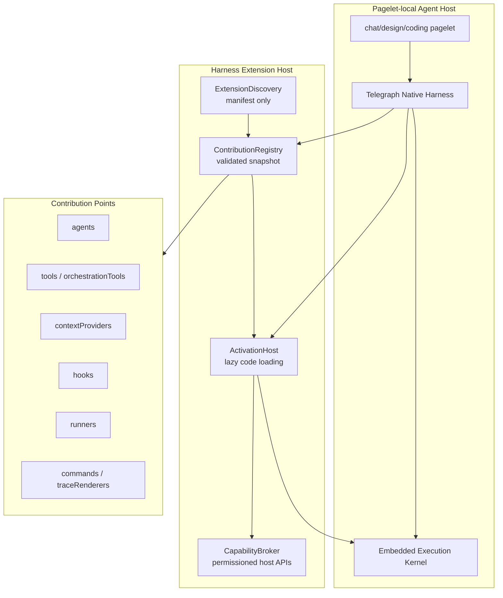

# Telegraph Harness Extension 架构设计

> 本文定义 Telegraph Native Harness 的 extension 架构。核心判断是：Telegraph 需要一套自己的
> harness extension / contribution model，用来组织 agent profile、tool、context、hook、
> runner 与 orchestration 能力；subagents 应作为 first-party platform extension 引入，而不是作为
> `pi-subagents` adapter 或外部生态目录兼容层。

## 1. 设计结论

Telegraph 的 agent 产品层已经在 [D-015](../discussion/20260520-agent-runtime-product-layer-alignment.md)
中收敛为两条路径：

- **External Agent Runtime**：对 Codex CLI、Claude Code、Pi CLI 等完整外部 agent 产品走 spawn CLI / process integration。
- **Telegraph Native Harness**：对 Telegraph 自己的 agent profile、subagent、context、tool、trace、permission 与 UI 投影走内置 harness。

本文只设计第二条路径。Harness extension 是 Telegraph Native Harness 内部的扩展平台，不负责伪装成 Pi、Claude Code 或其他上游 extension host。

最终目标：

- subagents 通过 `@telegraph/subagents` 这样的 first-party platform extension 提供；它定义 delegation protocol、catalog builder、tool schema 与 child-run 投影，而不是封闭的 agent 列表。
- `scout`、`planner`、`reviewer` 等 agent 只是 `contributes.agents` 数据，属于默认 preset / 范式样板，不是硬编码 parser 分支或唯一可选集合。
- `subagent` 是 `contributes.orchestrationTools` 或 `contributes.tools` 贡献出来的 tool，不是 runtime adapter 名称。
- project/user/third-party agent profile 来源由 Telegraph 自己的 profile-source extension 或普通 harness extension 负责，不把 `.pi` 等第三方目录约定写进 harness core。
- Native Harness 在每次 run 开始时读取 extension registry snapshot，把可用 agents/tools/context 注入父模型 tool definition 和 system context。

## 2. 设计目标与非目标

### 2.1 目标

- **声明式优先**：extension 先通过 manifest 声明贡献点，harness 在未执行 extension 代码前就能知道可用能力。
- **懒激活**：只有当 run、tool、agent、context provider 或 UI 表面真正被使用时，才加载 extension 代码。
- **run 级确定性**：一次 run 使用一个 immutable contribution snapshot，避免流式执行中 registry 突然变化。
- **权限显式化**：extension 只能声明能力需求，真正执行 shell/filesystem/patch/network 等能力必须经过 CapabilityBroker / PermissionBroker。
- **可观测**：所有由 extension 贡献的 tool call、child run、context injection、hook transform 都必须带 origin，最终进入 RuntimeEvent / AgentEvent trace。
- **pagelet-local**：extension 能力由 pagelet-local harness 选择启用，不存在全局 agent extension 默认污染所有页面。
- **可组合**：同一套模型能承载 subagents、workspace context、design context、coding tools、trace renderer、provider integration 与未来 marketplace。

### 2.2 非目标

- 不在 Native Harness 内复刻 Pi extension host、Pi CLI loader 或 `.pi` 目录扫描规则。
- 不把 External Agent Runtime 的 CLI capability 混入 harness extension API。
- 不允许 extension 直接读写 renderer store、Electron IPC 或 x-oasis channel。
- 不把 workflow DSL 作为第一阶段核心；workflow/graph 可以是后续 contribution point。
- 不以 marketplace 为第一目标；先保证 first-party 与 project-local extension 的模型稳定。

## 3. 总体架构



### 3.1 Extension Package

一个 harness extension 由 manifest 加可选 activation module 组成。

```text
my-extension/
├─ telegraph.extension.json
├─ agents/
│  └─ scout.md
└─ dist/
   └─ activate.js
```

manifest 负责声明“有什么”；activation module 负责在真正使用时绑定“怎么做”。

### 3.2 ExtensionDiscovery

Discovery 只做纯数据扫描与解析，不执行 extension 代码。建议来源分层：

| 来源 | 示例 | 说明 |
|------|------|------|
| builtin | repo 顶层 `extensions/telegraph-subagents` | 默认随 Telegraph 版本发布，并在打包时进入 app bundle |
| user | `~/.telegraph/extensions` | 用户全局 extension |
| workspace | `<workspace>/.telegraph/extensions` | 项目级 extension |
| virtual | `@telegraph/workspace-agents` | 把 `.telegraph/agents/*.md` 投影为数据型 agent contributions |
| explicit run | run request 显式启用的 extension id | 单次任务的 capability profile |

核心原则：路径扫描是 source extension 的职责，不是 harness core 的业务分支。这样未来即使支持 importer，也只是新增 `@telegraph/pi-agent-importer`，而不是污染 core。

Profile source 的发现语义借鉴 `tintinweb/pi-subagents` 的成功经验，但不复制 Pi 路径：

- `.md` 文件名默认就是 agent runtime name，例如 `.telegraph/agents/db-migrator.md` 贡献 `db-migrator`。
- frontmatter 用来补充 description、tools、model、skills 等元数据，不要求写 `name` 才能被发现。
  Telegraph native 字段以 camelCase 为主，但 profile parser 接受常见 snake_case alias
  （如 `prompt_mode`、`fallback_models`），降低用户从其他 agent markdown 迁移的摩擦。
- 如果 manifest 的 `contributes.agents[]` 与其 `prompt` 指向的 markdown frontmatter 同时声明
  `title`、`description`、`tools` 或模型/上下文字段，markdown frontmatter 是 profile metadata 的最终来源；
  manifest 中的字段只作为 extension contribution 索引和 fallback，避免双写漂移进入 parent catalog。
- scope overlay 必须确定性：builtin < user < workspace/project；高优先级同名 profile 覆盖低优先级。
- 目录扫描稳定排序，保证 snapshot 和 tool enum 在同一输入下可复现。
- 第三方格式只通过 importer/profile-source extension 转换为 Telegraph native contribution，不进入 harness core。

`pi-subagents` 的完整实现解剖见
[R-002 pi-subagents 实现解剖与 Telegraph Native Harness 借鉴清单](../reference/20260521-pi-subagents-implementation-study.md)。

### 3.3 ContributionRegistry

Registry 负责把各来源 manifest 合并为标准化贡献表：

- 校验 schema、id、版本与 engine 兼容性。
- 解析相对路径，例如 agent prompt file、icon、template。
- 处理命名空间与冲突。
- 根据 pagelet、workspace policy、user setting、run profile 过滤贡献。
- 生成 immutable `HarnessContributionSnapshot`。

一次 agent run 只能读取 snapshot，不能直接访问可变 registry。

### 3.4 ActivationHost

ActivationHost 按 activation event 懒加载 extension code：

- `onAgentRun:telegraph-native`
- `onAgent:<agentId>`
- `onTool:<toolId>`
- `onContext:<contextProviderId>`
- `onPagelet:<pageletId>`
- `onCommand:<commandId>`

Activation module 只能拿到 `HarnessExtensionContext`，里面是受限 API，不暴露 Electron、x-oasis 或 renderer internals。

### 3.5 CapabilityBroker

CapabilityBroker 是 extension code 到宿主能力的唯一通道。它把当前 `CapabilityHost`、`HookBus`、`ToolRegistry`、`PermissionBroker` 的能力收敛成更稳定的 extension API。

extension 可以请求：

- feedback：在 chat/design/coding 中投影 note、progress、confirmation。
- tool：注册或执行经过 schema 与 permission 验证的 tool。
- filesystem：读取/写入授权范围内的 workspace 文件。
- process：执行经过授权的 shell/process 能力。
- patch：生成 preview 与 apply patch。
- trace：记录 extension-originated events。

extension 不直接拿 Node `fs`、`child_process` 或 UI store。

## 4. Manifest 契约草案

下面的示例里 `@telegraph/subagents` 同时提供平台能力与少量默认 agent preset。这里的
`scout` 只是 `agents/` 目录下的范式样板；用户、workspace 或第三方 extension 可以通过同一
`contributes.agents` 机制继续贡献新的 subagent profile。

```json
{
  "id": "@telegraph/subagents",
  "displayName": "Telegraph Subagents",
  "version": "0.1.0",
  "engines": {
    "telegraph": ">=0.1.0"
  },
  "pagelets": ["chat", "coding", "design"],
  "activationEvents": ["onAgentRun:telegraph-native", "onTool:subagent"],
  "contributes": {
    "agents": [
      {
        "id": "scout",
        "title": "Scout",
        "description": "Finds relevant files, symbols, and context before implementation.",
        "prompt": "./agents/scout.md",
        "tools": ["workspace.read", "workspace.search"],
        "runner": "embedded-kernel"
      }
    ],
    "orchestrationTools": [
      {
        "id": "subagent",
        "title": "Subagent Delegation",
        "description": "Delegate bounded work to one or more contributed agents.",
        "agentSource": "enabled-registry",
        "scope": "parent-selector"
      }
    ],
    "contextProviders": [
      {
        "id": "agent-catalog-summary",
        "description": "Summarizes available subagents for the parent model.",
        "activation": "onAgentRun:telegraph-native"
      }
    ]
  },
  "permissions": [
    {
      "kind": "filesystem.read",
      "scope": "workspace"
    }
  ],
  "main": "./dist/activate.js"
}
```

对应 TypeScript 契约可先保持窄而稳定：

```typescript
export interface HarnessExtensionManifest {
  id: string
  displayName: string
  version: string
  engines?: { telegraph?: string }
  pagelets?: string[]
  activationEvents?: ActivationEvent[]
  contributes?: HarnessContributions
  permissions?: PermissionRequest[]
  main?: string
}

export interface HarnessContributions {
  agents?: AgentContribution[]
  tools?: ToolContribution[]
  orchestrationTools?: OrchestrationToolContribution[]
  contextProviders?: ContextProviderContribution[]
  hooks?: HookContribution[]
  runners?: RunnerContribution[]
  commands?: CommandContribution[]
  traceRenderers?: TraceRendererContribution[]
}

export interface AgentContribution {
  id: string
  title: string
  description: string
  prompt: string
  tools?: string[]
  runner?: string
  defaultContext?: string[]
  metadata?: Record<string, unknown>
}
```

## 5. Contribution Points

| Contribution Point | 消费者 | 用途 |
|--------------------|--------|------|
| `agents` | Native Harness / subagent tool | 声明可被父 agent 选择的 agent profile，例如 `scout`、`planner`、`reviewer`。 |
| `tools` | ToolRegistry | 声明普通模型工具，例如 search、read、patch、web、design artifact。 |
| `orchestrationTools` | Parent selector / Native Harness | 声明会创建 child run 或多 agent 执行计划的工具，例如 `subagent`。 |
| `contextProviders` | Prompt/context builder | 在 run 开始或特定事件时注入 workspace、canvas、session、agent catalog 等上下文。 |
| `hooks` | HookBus | 声明 input/tool/run 生命周期 hook，允许扩展做 preprocess、policy check、context enrich。 |
| `runners` | Embedded Execution Kernel | 声明 agent profile 使用的执行后端，例如 `embedded-kernel`、future graph runner。 |
| `commands` | UI command palette / settings | 声明用户可触发命令，例如 refresh agent catalog。 |
| `traceRenderers` | Trace/Timeline UI | 声明特定 event payload 的 UI 投影方式。 |

第一阶段最重要的是 `agents`、`orchestrationTools`、`contextProviders`、`tools`。其他贡献点可以保留 schema 位置，但不急于实现完整 UI。

## 6. Subagents 作为可扩展平台 Extension

`@telegraph/subagents` 应该是 Telegraph 自带的 subagent platform extension，而不是特殊 runtime adapter，
也不是封闭的“内置 agent 集合”。

它负责：

- 定义 subagent profile 的贡献契约、catalog 生成方式、父模型 tool schema 与 child-run 事件投影。
- 贡献 `subagent` orchestration tool。
- 随包提供少量默认 agent presets：`scout`、`planner`、`worker`、`reviewer` 等，作为 `agents/` 目录里的范式样板。
- 接收 user/workspace/third-party extension 继续贡献的 agent profiles，并把它们纳入同一个 registry snapshot。
- 在 run 开始时基于当前启用的 profile snapshot 生成 agent catalog context，让父模型知道有哪些 agent、何时使用、限制是什么。
- 在 `subagent` tool 被调用时创建 child run plan。
- 把 child run lifecycle 投影为标准 RuntimeEvent / AgentEvent。

它不负责：

- 扫描 `.pi` 或模拟 Pi extension loader。
- 绕过 PermissionBroker 执行 shell/filesystem。
- 在核心代码里硬编码 agent 名称判断。
- 把 `scout` 等默认 preset 当作平台唯一支持的 agent 集合。

### 6.1 `use scout to find auth file` 的目标链路

```text
User prompt
  "use scout to find auth file"
      |
      v
Native Harness starts run
      |
      v
ContributionRegistry snapshot includes:
  - tool: subagent
  - agents from enabled profiles:
      scout from @telegraph/subagents preset
      db-migrator from workspace/user extension
      |
      v
Parent model request includes:
  - system catalog: Scout = finds files/context
  - subagent tool schema:
      agent enum = resolved aliases from the snapshot
      task = string
      output = structured summary
      |
      v
Model calls subagent({ agent: "scout", task: "find auth file" })
      |
      v
@telegraph/subagents activates onTool:subagent
      |
      v
Embedded Execution Kernel runs child agent with Scout profile
      |
      v
RuntimeEvent stream emits parent tool call + child run events + result
```

这个链路解决当前问题的关键在于：agent catalog 必须进入父模型的 prompt 和 tool definition，
而 catalog 来源必须是当前启用的 profile registry，不是固定写死的内置列表。
如果父模型只看到一个泛化的 `subagent` tool，却没有 `scout` 的声明，它自然会把 `scout`
当作用户项目里的未知工具。

## 7. 命名空间与冲突策略

Contribution id 在 registry 内部使用全限定名：

```text
@telegraph/subagents/scout
workspace.agents/scout
user.agents/reviewer
```

模型可见 alias 可以是短名，例如 `scout`。短名冲突时必须确定性处理：

- builtin < user < workspace < explicit run override，优先级逐级升高。
- 默认不允许静默覆盖 first-party contribution。
- 覆盖必须显式声明 `replaces` 或由 run profile 指定。
- tool schema 中的 enum 必须使用 resolved alias，trace 中记录 full id。

这样既保留用户自定义能力，又避免“某个 workspace 文件悄悄改变内置 scout 行为”的维护风险。

## 8. Extension API 边界

Activation module 的 API 应该是窄接口：

```typescript
export interface HarnessExtensionContext {
  readonly extensionId: string
  readonly pageletId: string
  readonly workspace?: WorkspaceRef
  readonly contributions: ExtensionContributionView
  readonly capabilities: CapabilityBroker
  readonly hooks: HookRegistrationAPI
  readonly trace: ExtensionTraceAPI

  registerTool(tool: RuntimeToolBinding): Disposable
  registerContextProvider(provider: RuntimeContextProvider): Disposable
  registerRunner(runner: RuntimeRunnerBinding): Disposable
}
```

这里借鉴 Pi coding-agent extension 的一个优点：extension author 通过注册 API 提交能力，runner 在宿主绑定真实动作之后执行。但 Telegraph 需要比 Pi 更严格：

- registration 必须能回溯到 manifest contribution，或者显式标记为 runtime-only contribution。
- runtime-only contribution 默认只在当前 activation/run 生命周期内有效。
- extension API 不暴露 host 内部对象，只暴露能力代理。
- 所有 registration 都带 origin 和 dispose 生命周期。

## 9. 与现有代码的落点

当前 `packages/agent` 已经有几块可复用原语：

- `packages/agent/src/harness/CapabilityHost.ts`：可演进为 CapabilityBroker 的底层适配。
- `packages/agent/src/harness/HookBus.ts`：可承载 extension hooks。
- `packages/agent/src/extensions/ExtensionManifest.ts`：旧的 tool-focused manifest，不应继续扩展为“万能兼容层”，建议迁移为新的 `HarnessExtensionManifest` 或保留为 legacy tool manifest adapter。
- `packages/agent/src/extensions/harness/`：已承载 `HarnessExtensionManifest`、`ContributionRegistry`、snapshot、activation/capability broker MVP。
- `extensions/telegraph-subagents/`：已承载 `@telegraph/subagents` first-party platform extension、preset profiles、runtime implementation 与 tests。

推荐把“extension host 实现”和“extension packages”拆成两个层级：

- `packages/agent` 放宿主运行时代码：manifest schema、registry、discovery、activation、capability broker。
- repo 顶层 `extensions/` 放扩展包本体：manifest、agent prompt、activation module、assets、tests。

这样 extension 在仓库结构上与 `packages/` 平级，语义上是 Telegraph 产品能力，而不是某个 npm package 的内部子目录。

推荐目标目录：

```text
/
├─ extensions/
│  ├─ telegraph-subagents/
│  │  ├─ telegraph.extension.json
│  │  ├─ agents/
│  │  │  # preset profiles / examples, not a closed platform list
│  │  │  ├─ scout.md
│  │  │  ├─ planner.md
│  │  │  └─ reviewer.md
│  │  ├─ src/
│  │  │  └─ activate.ts
│  │  └─ package.json
│  └─ workspace-agents/
│     ├─ telegraph.extension.json
│     └─ src/
│        └─ activate.ts
└─ packages/
   └─ agent/
      └─ src/
         └─ extensions/
            ├─ harness/
            │  ├─ HarnessExtensionManifest.ts
            │  ├─ ContributionRegistry.ts
            │  ├─ ExtensionDiscovery.ts
            │  ├─ ActivationHost.ts
            │  ├─ CapabilityBroker.ts
            │  └─ HarnessContributionSnapshot.ts
            └─ legacy/
               └─ ToolManifestAdapter.ts
```

`runtime/telegraphSubagents` 不作为目标态目录；代码已迁移到
repo 顶层 `extensions/telegraph-subagents`。Native Harness 只通过 registry 读取，不再按旧 runtime 目录名选择
subagent implementation。`packages/agent/src/extensions/harness` 只知道“加载 extension package 并产出 snapshot”，
不内置 subagents 的业务逻辑。

## 10. 实施路线

### Phase 1：Contribution Schema + Snapshot

- ✅ 新增 `HarnessExtensionManifest` 与 `HarnessContributions` 类型。
- ✅ 实现 `ContributionRegistry`，支持手工注册 builtin manifests。
- ✅ 在 repo 顶层建立 `extensions/` 目录约定，first-party extension 与 `packages/` 平级管理。
- ✅ 生成 `HarnessContributionSnapshot`，包含 resolved agents/tools/contextProviders。
- ✅ 测试 alias resolution、workspace override 与 snapshot catalog。

### Phase 2：Subagents Manifest 化

- ✅ 把默认 subagent profiles 作为 preset/example profiles 移入 `@telegraph/subagents` manifest。
- ✅ 将 `@telegraph/subagents` 扩展包落在 `extensions/telegraph-subagents`，而不是 `packages/agent/src` 内部。
- ✅ 父模型的 `subagent` tool schema 从 snapshot 生成，`agent` 字段使用 enum。
- ✅ run system context 注入 agent catalog summary。
- ✅ 移除以 `runtime/telegraphSubagents` 目录名作为入口的特殊分支。
- ✅ 验收 `use scout to find auth file` 所需的 agent catalog/tool enum 链路。
- ✅ 新增 `SubagentManager` / `StreamingSubagentRunner`，让 child run 先成为可记录、可取消、可查询的 lifecycle entity。
- ✅ single/chain/parallel 的 child execution 已统一走 `SubagentManager.spawnAndWait()`。
- ✅ Chat / Design pagelet service 注入 pagelet-local `SubagentManager`，并通过 RPC 暴露 `listSubagents`、`getSubagentResult`、`cancelSubagent`。
- ✅ parent final synthesis turn 暴露 `get_subagent_result` tool，让父模型通过 child run id 显式读取并消费 child result；失败时回落到 deterministic child output 聚合。

### Phase 3：ActivationHost + CapabilityBroker

- 实现 activation event 分发。
- 将 `CapabilityHost` 包装为受限 `CapabilityBroker`。
- 让 `@telegraph/subagents` 的 tool execution 通过 activation module 注册。
- trace 中记录 extension id、contribution id、activation event、permission decision。

### Phase 4：Profile Source Extensions

- ✅ 新增 `@telegraph/workspace-agents`，把 `.telegraph/agents/*.md` 投影为 data-only agent contributions。
- ✅ 新增 user-level profile source，读取 `~/.telegraph/agents`。
- ✅ 自定义 agent profile 使用 filename-derived runtime name，frontmatter 只负责元数据。
- ✅ manifest agent contribution 与 markdown frontmatter 发生漂移时，discovery 会用 markdown frontmatter
  hydrate snapshot，确保 parent catalog 与 runtime definition 看到同一份 profile metadata。
- 允许普通 harness extension 通过 `contributes.agents` 发布自己的 subagent profiles，不需要 fork `@telegraph/subagents`。
- 可选新增 importer extension，将第三方格式转换成 Telegraph native agent profile，但不在 core 中内置第三方路径语义。

### Phase 5：UI 与第三方扩展

- settings 中展示已发现 extension、贡献点、权限需求、启用范围。
- 支持 project-local extension 开发与热刷新。
- 设计第三方 extension 的沙箱、签名、版本兼容与 crash isolation。

## 11. 验收标准

- 在 orchestration 设置为 Telegraph Native Subagents 时，父模型请求中可看到 `subagent` tool，且 `agent` schema 枚举包含 registry snapshot 内的 agent aliases。
- 用户输入 `use scout to find auth file` 时，模型不再追问 `scout` 是什么，而是调用 `subagent({ agent: "scout", ... })` 或在回答中明确选择 Scout。
- 用户或 workspace 新增一个自定义 profile（例如 `.telegraph/agents/db-migrator.md` 或某个 extension 的 `contributes.agents`）后，不改核心代码也能进入 agent catalog 与 `subagent.agent` enum。
- 新增/移除 agent profile 不需要修改 parent selector parser 或 runtime adapter 名称。
- `scout`、`planner`、`reviewer` 在实现中只作为 preset data 存在，不作为特殊 case 出现在 orchestration 逻辑里。
- `packages/agent` 内不存在 `piSubagents` 命名或 `.pi` 路径扫描作为 native harness core 行为。
- Extension contribution 的 origin 出现在 trace 中，便于 UI 显示“该 tool/agent 来自哪个 extension”。
- Chat/design/coding pagelet 可以选择不同 extension set，不共享一个全局 mutable registry。
- Chat/design pagelet browser service 可以查询、消费或取消当前 pagelet 的 child run snapshot。
- Parent synthesis model request 中可看到 `get_subagent_result` tool，且 tool result 来自 pagelet-local `SubagentManager`，不会绕过 RuntimeEvent / harness 边界。

## 12. 关键取舍

### 12.1 为什么不用 Embedded Runtime Host 作为产品抽象

Embedded Execution Kernel 是 Native Harness 的执行内核，不应成为用户或 extension author 理解产品的第一层概念。extension author 关心的是贡献 agents/tools/context；harness 关心的是如何把这些贡献组织成一次 run；kernel 只是执行 model loop/tool loop 的底座。

### 12.2 为什么 subagents 是 extension 而不是 runtime adapter

runtime adapter 适合接入完整外部执行模型，例如 LangGraph graph executor 或外部 CLI process。Subagent delegation 本质上是 Telegraph Native Harness 内部的 orchestration 能力：它选择 agent profile、创建 child run、复用同一套 tool/permission/trace 协议。因此它更自然是 first-party extension contribution。

### 12.3 为什么不直接兼容 Pi extension

Pi extension 的价值在于启发了“extension API + runner binding”的实现思路，但它的目录、loader、runtime action 与 UI 假设属于 Pi 产品。Telegraph 如果把这些假设放入 core，就会重新陷入 adapter 层被上游私有语义拖住的问题。正确做法是：

- External Agent Runtime 运行 Pi CLI，让 Pi 自己处理 Pi extension。
- Native Harness 支持 Telegraph extension。
- 需要迁移时写 importer 或 compatibility profile，但它们都是可选 extension，不是核心架构。

## 13. Open Questions

- third-party activation module 是否需要独立 utility process/sandbox，还是先以 trusted local extension 运行。
- `contributes.runners` 与未来 graph/orchestrator adapter 的接口边界要多窄。
- trace renderer 是否进入 first-party extension API，还是先由 UI 内部注册。
- workspace extension 的默认信任模型如何与 Git repo、settings profile、permission prompt 结合。

这些问题不阻塞 Phase 1-3。先把 static contribution、subagent manifest、run snapshot 和 parent tool schema 这条主链打通，后续扩展点才有稳定地基。
