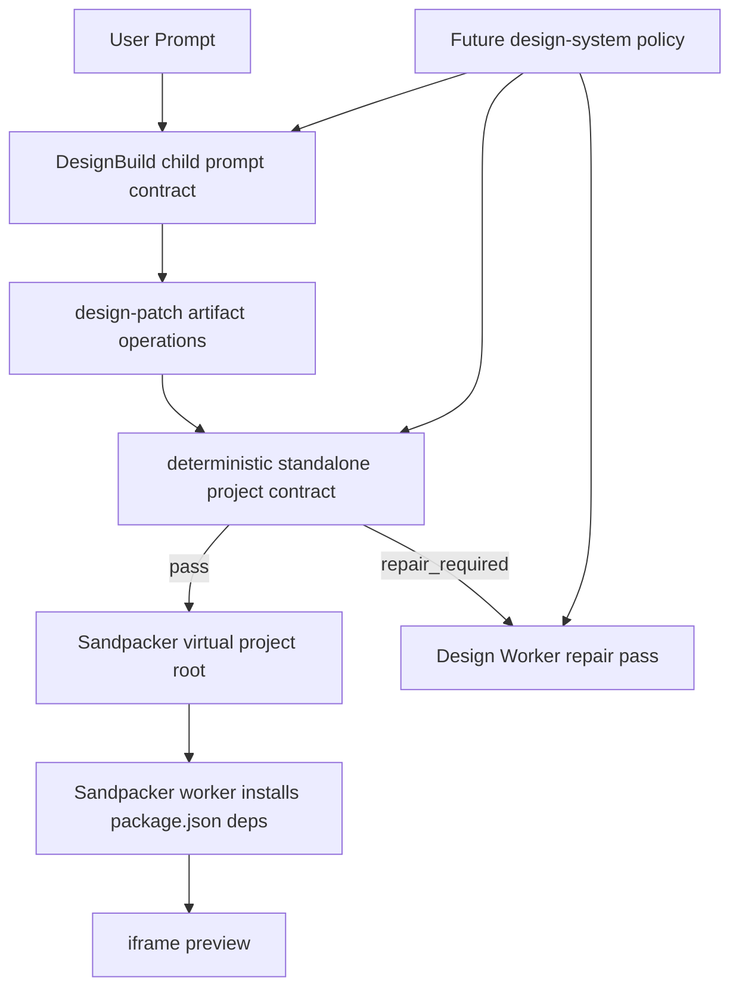

# DesignBuild 独立项目输出契约与设计系统约束底座

> DesignBuild 的出码产物不应只是一个“看起来像页面”的 TSX 片段，而应是一个可被 Sandpacker 独立安装依赖、独立编译、独立预览的项目单位。
> 本文沉淀本轮修复后的底层设计：把模型提示词、artifact 结构、Sandpacker 映射、确定性校验与 review/repair 闭环拆开，作为未来接入 design tokens、shadcn UI、企业 UI library 约束的基础。

## 1. 背景与问题

早期 `DesignBuildArtifacts` 的 fallback artifact 把页面类型、UI 组件 import、布局数据都写死在后端模板里。典型问题有三类：

1. **不是项目维度**：输出只是 `apps/design/src/generated/<slug>.tsx`，缺少 `package.json`、`index.html`、entry、CSS 等独立运行所需文件。
2. **依赖关系被宿主偷补**：Sandpacker preview 在浏览器侧强行塞默认 `package.json` 和 `telegraph-ui` stub，导致模型不必声明真实 npm 依赖。
3. **结构一致性无校验**：模型可能生成 `src/index.tsx` import `./ProfilePage`，但 artifact 里只有 `src/App.tsx`，直到 Sandpacker 编译时才暴露。

这类问题不能靠“给模型一个更大的模板”彻底解决。模板只能提供起点；真正稳定的边界必须是 **artifact contract + deterministic validation + repair loop**。

## 2. 设计结论

本轮落地后的核心判断：

- **输出单位是项目，不是组件**：`design-patch` operations 描述一个 generated project folder，至少包含 `package.json`、`index.html`、React entry、可渲染组件文件和样式。
- **依赖来源是 package.json，不是 Telegraph workspace**：凡是源码 import 的外部库，都必须进入 generated project 的 `package.json`。
- **模型负责创造，系统负责验收**：prompt 告诉模型目标结构；`design-project-contract.ts` 负责用确定性规则判断结构能否运行。
- **Sandpacker 是投影目标，不是业务契约**：artifact 路径仍在 workspace 安全路径内，preview 层把 generated project root 投影成 Sandpacker 的 `/`。
- **组件文件名不被 App.tsx 绑死**：允许 `ProfilePage.tsx`、`DashboardPage.tsx` 等语义化文件名，但 entry 的相对 import 必须能解析到实际生成文件。

## 3. 当前源码落点

| 层 | 文件 | 职责 |
|---|---|---|
| fallback artifact | `apps/design/src/application/node/design-build/DesignBuildArtifacts.ts:73-125` | 兜底生成完整 Vite React 项目文件组，而不是单文件 TSX。 |
| 模型契约提示 | `apps/design/src/application/node/design-build/DesignBuildChildRunner.ts:151-163` | 要求模型返回 standalone Sandpacker/Vite React 项目，且 entry import 与组件文件一致。 |
| 确定性项目校验 | `apps/design/src/application/common/design-project-contract.ts:31-91` | 检查 package root、package.json、index.html、React entry、可渲染源文件、本地 import 图与 workspace-only import。 |
| 本地 import 解析 | `apps/design/src/application/common/design-project-contract.ts:151-190` | 解析 `import './ProfilePage'` / dynamic import，确认相对路径能命中生成文件。 |
| Sandpacker 投影 | `apps/design/src/application/browser/DesignSandpackerPreview.tsx:303-357` | 从 artifact operations 推断 project root，将 `apps/design/src/generated/foo/package.json` 投影为 `/package.json`。 |
| review/validation | `DesignBuildReviewPolicy.ts` / `DesignBuildValidation.ts` | 把 standalone project contract 接入 review 与 repair gate。 |

## 4. 分层模型



这个模型的关键是：**同一份约束同时作用于生成前、生成后、修复时**。

- 生成前：prompt 让模型知道应该输出什么。
- 生成后：确定性 contract 拒绝结构不完整的 artifact。
- 修复时：review failure 变成 repair input，让模型基于明确失败项补文件或改 import。

## 5. 独立项目契约

当前最低契约如下：

```text
apps/design/src/generated/<slug>/
  package.json
  index.html
  src/index.tsx or src/main.tsx
  src/<component>.tsx
  src/styles.css or equivalent style files
```

### 5.1 package.json 是依赖事实源

`package.json` 的角色不是装饰文件，而是 Sandpacker 下载依赖的 manifest。模型若使用 `lucide-react`、`framer-motion`、`@radix-ui/react-tabs`、`class-variance-authority` 等库，必须声明在 generated project 的 `dependencies` 或 `devDependencies`。

这带来两个好处：

- preview 的成功不依赖 Telegraph monorepo 当前安装了什么。
- 未来可以用 package policy 做白名单、版本锁定、license policy、design system preset。

### 5.2 entry import 图必须闭合

本轮暴露的 `ProfilePage` 问题说明：检查“存在 `App.tsx`”还不够，必须检查 entry 的相对 import 图。

允许：

```typescript
// src/index.tsx
import ProfilePage from './ProfilePage'
```

前提是 artifact 同时包含：

```text
src/ProfilePage.tsx
```

也允许：

```typescript
// src/index.tsx
import App from './App'
```

前提是 artifact 包含：

```text
src/App.tsx
```

这就是 `standalone-local-imports` check 的意义：不强制某个文件名，但强制文件图自洽。

### 5.3 禁止 workspace-only import

生成项目应避免：

```typescript
import { Button } from '@/packages/ui/components/ui/button'
```

原因是 Sandpacker 的 npm sandbox 不能直接解析 Telegraph workspace alias。未来如果要使用 shadcn UI，应该通过两种方式之一接入：

1. **local source vendoring**：artifact 同时输出 `src/components/ui/button.tsx`、`src/lib/utils.ts` 等本地文件。
2. **package-backed library**：使用真正发布到 npm 的 UI package，并在 `package.json` 声明依赖。

## 6. 为什么不是“直接给模型 react.ts 模板”

`sandpacker/packages/web/src/examples/react.ts` 这类模板可以作为 **few-shot 示例** 或 fallback scaffold，但不应成为唯一约束来源。

模板解决的是“起步形状”，契约解决的是“可接受边界”。

| 方案 | 能解决 | 不能解决 |
|---|---|---|
| 给模型完整模板 | 让输出更像项目 | 无法保证模型后续改名、加库、拆文件后仍自洽 |
| 只靠 Sandpacker 报错 | 真实运行反馈 | 错误太晚，repair input 不结构化，用户体验差 |
| 确定性项目契约 | 快速定位缺文件、缺依赖入口、workspace import | 不能判断视觉质量和交互合理性 |
| Design reviewer / repair | 处理语义和视觉问题 | 不能替代基础结构校验 |

所以推荐组合是：

```text
template examples 作为上下文
+ prompt contract 作为模型目标
+ deterministic contract 作为硬门禁
+ reviewer/repair 作为迭代闭环
```

## 7. 未来 Design System 扩展路径

未来接入 design tokens、shadcn UI、企业 UI library 时，不应该回到“后端按 archetype 拼 import”的旧模式，而应扩展同一个 contract 系统。

### 7.1 Design System Policy

可以新增一个 `DesignSystemPolicy`，由 DesignBuild context 注入给 worker/reviewer：

```typescript
interface DesignSystemPolicy {
  id: string
  packagePolicy: {
    allowedDependencies: string[]
    pinnedVersions: Record<string, string>
  }
  tokenPolicy: {
    source: 'css-variables' | 'tailwind-theme' | 'design-token-json'
    requiredTokens: string[]
    forbiddenRawColors?: boolean
  }
  uiLibraryPolicy: {
    mode: 'local-shadcn-source' | 'published-package' | 'none'
    requiredFiles?: string[]
    importRules?: Array<{ pattern: string; replacement?: string }>
  }
}
```

这不是运行时代码必须马上实现的 API，而是后续扩展的方向：**把 design system 从“提示词建议”升级为“可校验 policy”**。

### 7.2 Token 约束

Design tokens 可以落在三处：

- `src/styles.css` 的 CSS variables，例如 `--color-primary`、`--radius-md`。
- `tailwind.config.ts` / Tailwind v4 CSS theme。
- `tokens.json` 或 `src/design-tokens.ts`。

对应 contract 可以增加：

- `standalone-design-tokens-present`：检查 token 文件或 CSS variables 存在。
- `standalone-no-raw-colors`：限制 JSX / CSS 中散落 `#4f46e5` 这类 raw colors。
- `standalone-token-usage`：要求组件样式引用 token，而不是硬编码。

### 7.3 shadcn UI 约束

shadcn 的关键不是 npm 包，而是“代码复制进项目”。因此对 generated project 来说，应要求模型输出本地 UI primitive 文件：

```text
src/components/ui/button.tsx
src/components/ui/card.tsx
src/lib/utils.ts
```

然后 entry / page 文件使用项目内相对或 alias import。若 Sandpacker 不支持项目 alias，就优先使用相对路径，或者同步输出 `vite.config.ts` / `tsconfig.json` 中的 alias 配置。

后续可加入 check：

- `standalone-shadcn-local-files`：使用 `@/components/ui/button` 时，必须有 alias config 和对应文件。
- `standalone-cn-helper`：使用 class variance / `cn()` 时，必须输出 `src/lib/utils.ts` 并声明 `clsx`、`tailwind-merge`。
- `standalone-radix-deps`：使用 Radix primitive 时，`package.json` 必须声明对应 `@radix-ui/react-*`。

### 7.4 UI Library 能力包

长期可以把组件库约束建模为 capability pack：

```text
DesignSystemPack
  ├─ prompt snippets        // 给模型的使用说明
  ├─ package manifest       // 允许依赖与版本
  ├─ source templates       // 可 vendoring 的组件源码
  ├─ validators             // 确定性 checks
  └─ repair recipes         // 常见错误如何修复
```

这样未来切换“无 UI library / shadcn / 内部设计系统 / 第三方组件库”时，不需要改 `DesignBuildArtifacts` 的硬编码，而是切换 policy pack。

## 8. 后续建议

短期建议：

- 把 `design-project-contract.ts` 拆出更明确的 check registry，让每条 check 可独立开启、关闭、携带 repair hint。
- 让 reviewer 输出包含 failed check id，repair worker 直接看到 `standalone-local-imports` / `standalone-package-json` 等结构化原因。
- 对 `package.json` 增加 external import dependency check：源码 import `lucide-react` 时，必须在 dependencies 声明。

中期建议：

- 增加 `DesignSystemPolicy` 输入，先支持 tokens + dependency whitelist。
- 支持 shadcn local source pack，把常用 primitives 作为可注入文件，而不是 workspace alias。
- 给 Sandpacker preview 增加“contract failure panel”，在 iframe 编译前展示结构问题。

长期建议：

- 将 DesignBuild artifact 从“文件 operations”升级为“project manifest + file tree + policy report”的组合产物。
- 引入视觉/交互 reviewer：结构 contract 负责可运行，visual reviewer 负责布局、可访问性、移动端适配与 design system 一致性。
- 将 successful generated project 作为可 replay fixture，形成 regression corpus。
