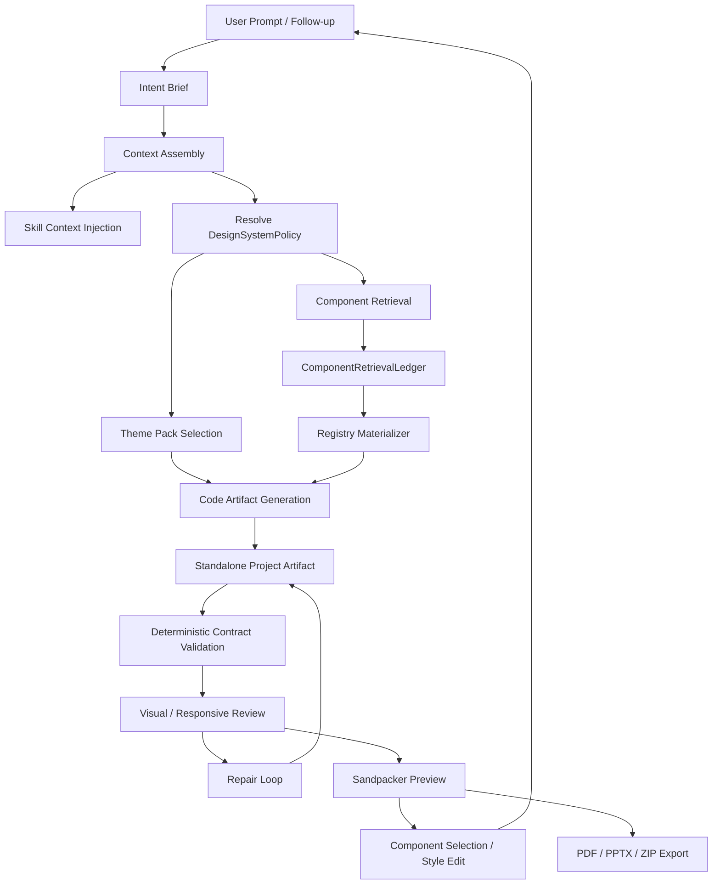

# Design Page shadcn-first 设计系统工厂架构

> Design Page 的下一阶段不应只是“聊天框生成 TSX”，而应成为一个受设计系统约束的 artifact factory。
> 这个 factory 接受自然语言与项目上下文，召回 shadcn/社区/内部组件资产，选择 theme pack，生成 standalone project artifact，再通过确定性 contract、视觉评审、组件级编辑与多格式 export 形成闭环。

## 来源

- [shadcn/ui Installation](https://ui.shadcn.com/docs/installation)
- [shadcn/ui CLI](https://ui.shadcn.com/docs/cli)
- [shadcn/ui MCP](https://ui.shadcn.com/docs/mcp)
- [shadcn/ui Theming](https://ui.shadcn.com/docs/theming)
- [shadcn/ui components.json](https://ui.shadcn.com/docs/components-json)
- [shadcn/ui Skills](https://ui.shadcn.com/docs/skills)
- [nexu-io/open-design](https://github.com/nexu-io/open-design)

## 1. 核心结论

Design Page 要从“能生成页面”升级为“能持续生产可验证设计 artifact”，需要补齐四个层次：

1. **Design System Policy**：把“必须优先使用 shadcn UI，只有缺组件时才手写”从 prompt 偏好升级为可注入、可追踪、可验证的 policy。
2. **Component Retrieval Ledger**：每次生成必须记录召回了哪些组件、来自哪个 registry、为什么选择、哪些需求无法覆盖、手写 fallback 是否被允许。
3. **Theme Pack**：把“风格”从一句自然语言变成 token、typography、density、motion、示例、反例与 reviewer check 的资源包。
4. **Export Pipeline**：Web preview、PDF、PPTX、ZIP/HTML 不应各自重新生成，而应是同一个 design artifact 的不同 projection。

一句话定位：

```text
Design Page = repo-aware DesignBuild Native Harness
            + shadcn-first DesignSystemPolicy
            + theme-pack controlled visual language
            + verifiable standalone project artifact
            + editable/exportable projection pipeline
```

## 2. 现有基座

截至 2026-05-24，仓库已经有以下底座：

| 层 | 现状 | 关键源码 |
|---|---|---|
| DesignBuild runtime | `telegraph-design-build` 已在 design pagelet 内以 Run 方式执行 | `apps/design/src/application/node/design-build/DesignBuildRuntime.ts` |
| 固定编排阶段 | brief / context / component retrieval / plan / artifact / review / repair | `apps/design/src/application/node/design-build/DesignBuildWorkflow.ts` |
| Standalone project contract | 检查 package root、`package.json`、entry、local import、workspace-only import | `apps/design/src/application/common/design-project-contract.ts` |
| Sandpacker projection | 将 generated project root 映射为 Sandpacker `/` | `apps/design/src/application/browser/DesignSandpackerPreview.tsx` |
| Subagent profile | design planner/scout/worker/reviewer 已作为 first-party profile 存在 | `extensions/telegraph-subagents/agents/*.md` |
| Skill loader | 可从 project `.skills`、`.telegraph/skills`、用户目录加载 skills | `packages/agent/src/skills/loader.ts` |
| Skill prompt 注入 | 已有显式 skill body formatter，DesignBuild child 可内联 profile.skills | `packages/agent/src/skills/prompt.ts`、`DesignBuildChildRunner.ts` |

关键差距是：当前 `ComponentAssetRegistry` 仍主要面向 `packages/ui` workspace 组件，适合未来 apply 到 Telegraph repo，但不适合 standalone Sandpacker generated project。A-014 已明确禁止 generated app import Telegraph workspace-only modules；因此后续 Design Page 的默认 preview 输出应走 **local shadcn source vendoring**，不是 `@/packages/ui/...` import。

## 3. 产品形态：从页面生成器到 artifact factory

完整产品应包含以下用户可见能力：

| 能力 | 用户体验 | 系统事实 |
|---|---|---|
| 一句话生成 | 用户描述页面目标，右侧出现可运行 app | 产生 `design-patch` standalone project artifact |
| 组件召回解释 | 用户可展开“使用了哪些组件” | `ComponentRetrievalLedger` 进入 trace 与 artifact metadata |
| 风格选择 | 用户选择或继承 `Linear-like`、`Stripe-like`、`dense SaaS` 等风格 | `ThemePack` 注入 prompt、CSS variables、reviewer |
| 组件编辑 | 用户点 preview 里的元素，再说“改大一点/换颜色” | selected DOM/source context 进入下一轮 run |
| 多轮修订 | 修改基于上一版 artifact，不丢失 provenance | artifact revision graph + operation summaries |
| 导出 | 用户导出 PDF / PPTX / ZIP / HTML | export worker 消费同一 artifact manifest |
| 可解释质量门禁 | 用户看到“为什么 repair” | deterministic checks + visual checks + reviewer verdict |

这个产品不应把 shadcn 做成“模型记忆中的 UI 风格”，而应把 shadcn 做成可召回、可复制源码、可校验依赖闭包的第一套 Design System Pack。

## 4. 端到端链路

推荐的 DesignBuild 目标链路：



分层职责：

- **生成前**：policy、skills、theme、retrieval 给模型边界。
- **生成中**：registry materializer 提供源码与依赖事实，模型主要负责编排、组合、页面语义和局部 app-specific 组件。
- **生成后**：contract + visual reviewer 负责验收。
- **迭代时**：selection、dirty operations、revision context 进入下一轮 run。
- **交付时**：export worker 从同一个 artifact manifest 派生格式，不重新发明视觉。

## 5. DesignSystemPolicy

`DesignSystemPolicy` 是未来 DesignBuild 的核心输入。它不应只是 prompt 文本，而应同时驱动 prompt、retrieval、materialization、validation、repair、export。

建议类型：

```typescript
interface DesignSystemPolicy {
  id: string
  mode: 'standalone-preview' | 'workspace-apply'
  uiLibrary: {
    priority: Array<'shadcn-official' | 'community-registry' | 'workspace-ui' | 'handwritten'>
    handwritePolicy: 'only-when-unavailable' | 'app-composition-only' | 'allowed'
    allowedRegistries: DesignRegistryRef[]
    blockedRegistries?: DesignRegistryRef[]
  }
  packagePolicy: {
    allowedDependencies: string[]
    pinnedVersions: Record<string, string>
    requireDependencyClosure: boolean
  }
  tokenPolicy: {
    source: 'css-variables' | 'tailwind-theme' | 'design-token-json'
    requiredTokens: string[]
    forbidRawColorsOutsideTheme: boolean
  }
  aliasPolicy: {
    importAlias: '@'
    sourceRoot: 'src'
    requireViteAlias: boolean
    requireTsconfigAlias: boolean
  }
  themePack?: ThemePackRef
  exportPolicy?: DesignExportPolicy
}
```

其中 `mode` 很关键：

- `standalone-preview`：生成 app 必须能在 Sandpacker/npm sandbox 内运行；禁止 `@/packages/ui/...`。
- `workspace-apply`：当用户确认 apply 到 Telegraph repo 时，可以使用 `packages/ui` 的 public exports，但仍需遵守 repo alias 规则。

这能解决当前 `ComponentAssetRegistry` 与 standalone contract 的张力：同一个 DesignBuild 可以有两套资产策略，而不是把 workspace UI import 偷偷塞进 preview artifact。

## 6. shadcn-first 的精确定义

用户提出的约束是：

> 接下来生成的应用要用 shadcn-ui 组件；只有当 shadcn-ui 组件没有的时候，才进行手写组件。

建议落成以下硬规则：

### 6.1 允许模型做什么

模型可以：

- 使用 shadcn registry 中的 `registry:ui` primitive，例如 button、card、tabs、dialog、input、textarea、table。
- 使用 shadcn block，例如 login form、sidebar layout、dashboard skeleton。
- 在 `src/components/app/*` 写 app-specific composition，如 `PricingTierCard`、`MetricStrip`、`BillingUsageChart`。
- 写页面级布局、mock data、状态、交互 glue code。
- 在 `src/styles.css` 写 theme tokens、responsive layout、少量 page-specific CSS。

### 6.2 不允许模型做什么

模型不应：

- 手写一个简化版 `src/components/ui/button.tsx` 冒充 shadcn Button。
- import `@/packages/ui/components/ui/button` 到 standalone project。
- 只声明 `lucide-react`，却漏掉 `@radix-ui/*`、`class-variance-authority`、`clsx`、`tailwind-merge` 等实际依赖。
- 生成 `@/components/ui/*` import 但不输出 alias config。
- 在 JSX 里散落 raw hex colors，而不是使用 shadcn semantic tokens。

### 6.3 允许 fallback 的条件

只有满足以下条件时才可手写组件：

1. retrieval ledger 中明确记录 `fallbackReason`。
2. 手写组件是 app-specific composition，不是替代 shadcn primitive。
3. reviewer 可判断该组件不应由 shadcn 覆盖。
4. validator 没有发现假冒 primitive。

示例：

```typescript
type HandwriteFallback = {
  role: 'calendar-heatmap'
  reason: 'not-found'
  searched: ['@shadcn/calendar', '@shadcn/chart', '@shadcn/table']
  allowedScope: 'src/components/app/ActivityHeatmap.tsx'
}
```

## 7. ComponentRetrievalLedger

`ComponentRetrievalLedger` 是召回率与还原度的中枢。它既给模型上下文，也给 reviewer 与 trace 做证据。

建议类型：

```typescript
interface ComponentRetrievalLedger {
  query: {
    prompt: string
    pageType: string
    roles: ComponentNeed[]
    selectedThemePack?: string
  }
  candidates: ComponentCandidate[]
  selected: SelectedComponentAsset[]
  fallbacks: HandwriteFallback[]
  rejected: RejectedComponentCandidate[]
}

interface ComponentNeed {
  role: string
  required: boolean
  examples: string[]
}

interface ComponentCandidate {
  registry: string
  name: string
  type: 'registry:ui' | 'registry:block' | 'registry:component'
  description?: string
  score: number
  reason: string
  dependencies?: string[]
  files?: string[]
}

interface SelectedComponentAsset extends ComponentCandidate {
  materializedFiles: string[]
  importExamples: string[]
}
```

### 7.1 召回顺序

推荐默认顺序：

```text
1. shadcn official registry
2. allowed community registries
3. workspace design-system packs
4. app-specific handwritten composition
```

为什么不是先 workspace UI：

- `packages/ui` 适合 Telegraph repo 内部 apply。
- Standalone generated project 需要 source vendoring 或 npm package。
- shadcn 本质是“复制源码进项目”，与 standalone preview 契约天然匹配。

### 7.2 召回方式

可用的 evidence source：

- `shadcn search @shadcn -q "<query>"`：召回 components / blocks。
- `shadcn docs <component> --json`：拿文档与示例链接。
- `shadcn view <item>`：拿 registry item JSON、files、dependencies。
- shadcn MCP：未来可作为 agent tool，让 Design Component Scout 直接调用。
- 项目 skill：例如 `design-shadcn-generation`，给模型静态规则与 fallback 边界。

注意：CLI/MCP 负责发现和获取事实；模型负责解释与组合。不要让模型凭记忆写 registry 源码。

## 8. Registry Materializer

`RegistryMaterializer` 负责把召回结果变成 generated project 内的文件操作。

建议职责：

```typescript
interface RegistryMaterializer {
  materialize(input: {
    projectRoot: string
    selected: SelectedComponentAsset[]
    policy: DesignSystemPolicy
  }): Promise<MaterializedRegistryResult>
}

interface MaterializedRegistryResult {
  operations: DesignPatchOperation[]
  dependencies: Record<string, string>
  devDependencies: Record<string, string>
  aliases: Record<string, string>
  provenance: RegistryProvenance[]
}
```

Materializer 应输出：

```text
apps/design/src/generated/<slug>/
  components.json
  package.json
  vite.config.ts
  tsconfig.json
  src/index.tsx
  src/App.tsx
  src/styles.css
  src/lib/utils.ts
  src/components/ui/button.tsx
  src/components/ui/card.tsx
  src/components/app/<composition>.tsx
  design-system.provenance.json
```

`design-system.provenance.json` 建议记录：

```json
{
  "policyId": "shadcn-first-standalone",
  "registries": ["@shadcn"],
  "components": [
    {
      "name": "button",
      "source": "@shadcn/button",
      "files": ["src/components/ui/button.tsx"],
      "dependencies": ["class-variance-authority", "radix-ui"]
    }
  ],
  "fallbacks": []
}
```

这个文件有两个价值：

- 给 reviewer 判断“是不是假的 shadcn primitive”。
- 给后续导出、修复、重放与 regression corpus 复用。

## 9. ThemePack

ThemePack 是“风格要求”的工程化形态。它不是一段 prompt，而是资源包。

建议类型：

```typescript
interface ThemePack {
  id: string
  label: string
  description: string
  useCases: string[]
  tokens: {
    cssVariables: Record<string, string>
    radius: string
    typography: ThemeTypography
    spacingScale: string[]
  }
  layoutRules: string[]
  motionRules: string[]
  examplePrompts: string[]
  antiPatterns: string[]
  reviewerChecks: Array<{
    id: string
    summary: string
  }>
}
```

示例 theme pack：

| Pack | 适用场景 | 特征 |
|---|---|---|
| `shadcn-new-york-neutral` | 默认 SaaS / dashboard | neutral base、紧凑、radius 适中、信息密度高 |
| `dense-operator-console` | CRM / ops / admin | 表格优先、低装饰、扫描效率高 |
| `editorial-commerce` | 商品 / 品牌 / portfolio | 大图、强节奏、内容区块明确 |
| `studio-dark` | creative tool / devtool | 深色、命令面板、canvas/workbench |
| `mobile-first-service` | onboarding / form / mobile web | 大 touch target、单列、状态清晰 |

ThemePack 应同时作用于：

- prompt：告诉模型视觉语言和 forbidden patterns。
- `src/styles.css`：写入 semantic CSS variables。
- reviewer：检查 raw colors、density、信息架构、首屏构图。
- export：PDF/PPTX 投影保持同一 visual identity。

## 10. Skill 上下文

项目已存在 skill loader，DesignBuild 应把 skill 分成两种：

| 类型 | 用途 | 注入方式 |
|---|---|---|
| Catalog skill | 告诉模型“有哪些 skill 可读” | `formatSkillsForPrompt()` |
| Selected skill body | 直接给模型完整规则 | `formatSelectedSkillBodiesForPrompt()` |

普通 subagent 有 `read` 工具，可以先看到 skill catalog，再读匹配 skill。

DesignBuild child 当前只有 `submit_design_child_output` tool。它不能在提交前再调用 read，因此必须把 profile 上的 selected skills 直接内联到 child system prompt。当前实现已经支持这一路径：

- `packages/agent/src/skills/prompt.ts:11-55`：向上查找 skill root，并格式化 selected skill bodies。
- `extensions/telegraph-subagents/src/SubagentRunner.ts:109-143`：普通 subagent 消费 `inheritSkills` 与 `skills`。
- `apps/design/src/application/node/design-build/DesignBuildChildRunner.ts:116-145`：DesignBuild child 内联 profile.skills。
- `extensions/telegraph-subagents/agents/design-worker.md` 等 profile 通过 `skills: design-shadcn-generation` 绑定 shadcn 规则。
- `skills/design-shadcn-generation/SKILL.md` 定义 shadcn-first standalone artifact 规则。

这条链路的意义是：未来新增 `design-deck-export`、`design-theme-linear`、`design-accessibility-review` 这类 skill 时，不需要重写 DesignBuild runtime，只要在 profile/policy 上选择对应 skill。

## 11. Validator 扩展

A-014 已有 standalone project contract。shadcn-first 之后需要新增 checks：

| Check ID | 目标 |
|---|---|
| `standalone-external-dependencies` | 源码 import 的外部包必须在 `package.json` 声明 |
| `standalone-alias-config` | 使用 `@/` import 时必须有 `vite.config.ts` / `tsconfig.json` alias |
| `standalone-shadcn-components-json` | generated project 包含 shadcn-compatible `components.json` |
| `standalone-shadcn-local-files` | `@/components/ui/*` import 必须对应本地文件 |
| `standalone-shadcn-provenance` | UI primitive 文件有 registry provenance 或 fallback 说明 |
| `standalone-no-fake-primitives` | 禁止未声明来源的手写 Button/Card/Dialog/Tabs 等 primitive |
| `standalone-cn-helper` | 使用 `cn()` 时必须有 `src/lib/utils.ts` 与 `clsx/tailwind-merge` |
| `standalone-radix-deps` | 使用 Radix primitive 时声明对应依赖 |
| `standalone-theme-tokens-present` | 存在 required semantic tokens |
| `standalone-no-raw-colors` | JSX/CSS 中 raw color 受限于 theme token 文件 |

这些 check 应进入 `DesignBuildReviewPolicy` 与 repair prompt，使失败不是“preview 编译报错后才知道”，而是生成后马上得到结构化 failure。

## 12. 视觉评审与还原度

确定性 contract 只能回答“能不能跑”。完整产品还需要回答“像不像、好不好用、有没有重叠、有没有移动端崩坏”。

建议增加 `VisualReviewWorker`：

```text
Artifact -> Sandpacker/Browser render
  -> screenshot desktop/mobile
  -> DOM metrics
  -> canvas nonblank check
  -> layout overlap check
  -> theme token scan
  -> accessibility quick scan
  -> visual review report
  -> repair prompt
```

视觉评审的第一阶段不必追求完全自动审美，可以先覆盖明确错误：

- preview blank / runtime error。
- 首屏主体被裁切。
- text overflow / button text clipped。
- mobile 横向溢出。
- 元素重叠。
- 过度单色 palette。
- hero / product page 首屏看不到真实对象或核心产品。
- dashboard 类工具过度营销页化。

这些规则与当前 frontend guidance 可以形成稳定 reviewer checklist。

## 13. 组件编辑闭环

P-009 已经提出 preview DOM selection 与 style editor 的 handoff。接下来应把它纳入 DesignSystemPolicy：

```typescript
interface ComponentEditContext {
  artifactId: string
  source: 'preview-dom' | 'patch-operation' | 'style-editor'
  label?: string
  elementTag?: string
  className?: string
  sourceLocation?: {
    filePath: string
    line: number
    column: number
  }
  componentProvenance?: {
    kind: 'shadcn-primitive' | 'app-composition' | 'fallback'
    registryName?: string
  }
  dirtyOperations?: DesignPatchOperation[]
}
```

局部编辑策略：

- 用户选中 shadcn primitive 的 instance，应修改 page/composition usage，不直接改 vendored primitive。
- 用户修改 theme-level 属性，应改 `src/styles.css` tokens，不散落修改多个 JSX class。
- 用户修改 app-specific composition，可改 `src/components/app/*`。
- 如果用户真的要求改 Button primitive，本次 run 必须标记为 `design-system-primitive-edit`，reviewer 检查影响面。

## 14. Export Pipeline

PDF/PPTX/ZIP 不应从用户 prompt 重新生成，而应从 artifact manifest 派生。

建议新增：

```typescript
interface DesignExportArtifact {
  id: string
  kind: 'design-export'
  sourceArtifactId: string
  sourceProjectRoot: string
  formats: DesignExportFormat[]
  themePackId?: string
  exports: Array<{
    format: DesignExportFormat
    path?: string
    status: 'planned' | 'generated' | 'failed'
    error?: string
  }>
}

type DesignExportFormat = 'html-zip' | 'pdf' | 'pptx' | 'png-screenshots'
```

### 14.1 PDF

PDF 建议使用 browser print pipeline：

1. Sandpacker/project preview 启动。
2. Browser worker 打开 export route。
3. 注入 print CSS。
4. 输出 PDF。
5. 把 PDF artifact 与 source artifact 关联。

### 14.2 PPTX

PPTX 不应简单截屏拼页。推荐两级策略：

- MVP：按 sections 生成 screenshot-based deck，每个 section 一页，保留 visual fidelity。
- V2：生成 semantic deck model，例如 title / chart / table / cards，再用 presentation skill/PPTX renderer 输出可编辑 deck。

PPTX export 需要保留：

- theme colors。
- typography scale。
- section hierarchy。
- component screenshots 或 semantic equivalents。
- source artifact reference。

### 14.3 HTML ZIP

HTML ZIP 是最接近 generated project 的交付：

- 包含完整 Vite project 或 built static output。
- 包含 `design-system.provenance.json`。
- 包含 `export-manifest.json`。
- 可选包含 screenshots 和 review report。

## 15. open-design 的借鉴边界

Open Design 值得借鉴的是 product asset organization，不是直接搬进程模型。

可借鉴：

- skill / design-system / prompt stack 作为显式资源。
- 用户可以选择 direction/style。
- 生成后支持多种 export。
- 对 agent 的产出做 preview 与 review。
- 用一套项目资源包提高风格一致性。

不建议照搬：

- 把所有 agent 都当成外部 CLI 进程作为 Design Page 默认路径。
- 让 Design Page 核心依赖某个外部 agent 的私有输出格式。
- 在 renderer 或 main 中理解某个 framework-specific event。

Telegraph 的长期定位仍是：

```text
Design Page = pagelet-local Native Harness
External CLI / Open Design-like tools = optional External Agent Runtime or importer
```

这与 D-012 / D-015 的分层一致。

## 16. 产品 UI 建议

建议增加几个用户可见但不打扰主流程的面板：

| 面板 | 用途 |
|---|---|
| Design System | 选择 shadcn official、community registry、workspace UI、theme pack |
| Retrieval | 展开本次召回组件与 fallback reason |
| Provenance | 查看当前 artifact 的组件来源、依赖、tokens |
| Review | 展示 deterministic / visual / reviewer checks |
| Export | 选择 PDF / PPTX / ZIP，并展示生成状态 |
| Revision Graph | 查看 artifact 多轮修改关系 |

默认交互仍应简单：

```text
输入需求 -> 生成 app -> 右侧 preview -> 继续修改 / 导出
```

高级面板只在用户需要解释、调试或导出时出现。

## 17. 非目标与红线

非目标：

- 不做通用 Telegraph Workflow DSL。
- 不把 shadcn registry item 全量缓存进 repo。
- 不让 renderer 直接访问外部 registry 或执行 CLI。
- 不让 generated project import Telegraph workspace internals。
- 不把 PDF/PPTX export 做成独立 prompt 重新生成。

红线：

- Runtime 仍只在 design pagelet utility process 内执行。
- 不新增 framework-specific `RuntimeEvent` 类型。
- 写 workspace 文件仍走 patch preview / user confirm / apply。
- shadcn-first 是 policy + validator，不只是 prompt wording。

## 18. Repo 落点建议

```text
apps/design/src/application/node/design-build/
  DesignSystemPolicy.ts
  ShadcnRegistryIndexer.ts
  ShadcnRegistryMaterializer.ts
  ComponentRetrievalLedger.ts
  ThemePackRegistry.ts
  DesignExportPipeline.ts
  VisualReviewWorker.ts

apps/design/src/application/common/
  design-system-contract.ts
  design-export-contract.ts

skills/
  design-shadcn-generation/
  design-theme-<name>/
  design-export-deck/

apps/design/src/application/browser/
  DesignSystemPanel.tsx
  DesignRetrievalPanel.tsx
  DesignExportPanel.tsx
```

其中 `DesignSystemPolicy.ts` 与 `design-system-contract.ts` 应先落，因为它们定义了后续所有 worker/reviewer/validator 的共同语言。

## 19. 长期判断

Design Page 的护城河不在“模型能写 React”，而在：

- 能把组件库、theme、skill、export 变成可选择、可解释、可验证的资源包。
- 能在本地 repo 中运行，知道项目约束，又不破坏 standalone preview。
- 能通过 Run trace 解释每一步，而不是黑盒生成。
- 能在视觉、源码、导出之间保持同一 artifact lineage。
- 能把 successful generated projects 变成 regression corpus，持续提高召回率与还原度。

换句话说，Design Page 应该成为 Telegraph 的 **design artifact factory**，而 shadcn-first 只是第一套 production-ready design-system pack。
