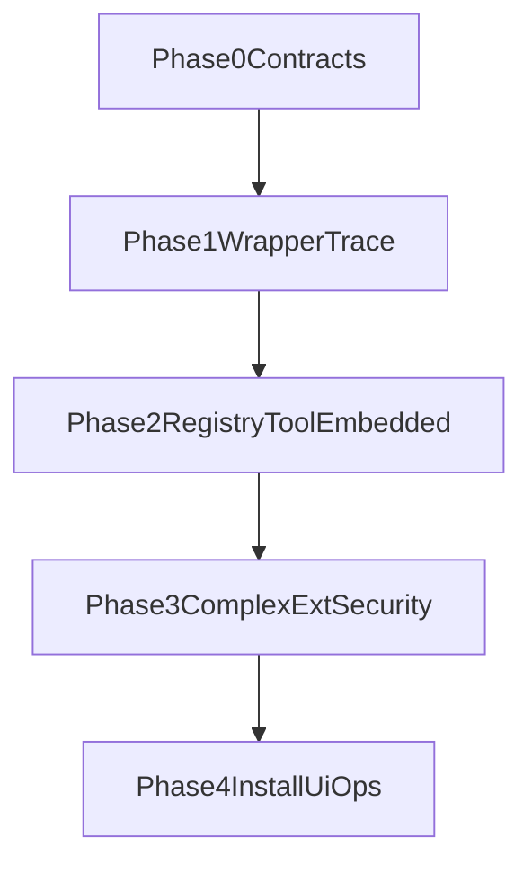

# Telegraph Agent Runtime / Extension Host 实施 Phase-Gate 模板

本文用于把 A-005 转成可执行门禁。它不是替代 A-005 的设计文档，而是用于每个阶段的 **go/no-go** 评审。

## 开始前必看（强建议，不阻塞）

为减少术语偏差与实现分叉，建议在进入 Phase 0 前先通读以下文档：

- [A-005：Telegraph Agent Runtime 与 Extension Host 理论基础](../architecture/20260505-telegraph-agent-runtime-extension-host-theory.md)  
  - 明确目标抽象：`Run`、`RuntimeEvent`、`ToolDefinition`、`ExtensionManifest`、`Hook`、`Permission`。
- [P-001：Telegraph 多智能体（类 Multica）分阶段路线图](./20260504-multi-agent-telegraph-roadmap.md)  
  - 对齐历史路线与阶段拆分，避免与旧阶段目标冲突。
- [A-002：Telegraph 多进程拓扑](../architecture/20260504-multi-process-topology.md)  
  - 统一 main/daemon/renderer 的边界认知，避免把执行器职责放错进程。
- [I-002：pi-ai 流式首包后卡住复盘](../issue/20260505-pi-ai-llm-trace-await-sink-deadlock.md)  
  - 作为事件通道与背压设计的反例基线，防止同类死锁回归。

## 使用方式

- 每个阶段开始前，先确认 **Entry Criteria**。
- 阶段结束时必须满足 **Exit Criteria**，并产出 **Gate Evidence**。
- 命中 **No-Go Criteria** 时，不进入下一阶段，先补齐阻塞项。
- 每次 Gate 评审结论都写入本文件（通过/有条件通过/不通过 + 决策日期 + owner）。

## Gate 评审记录模板

```markdown
### Gate Review - Phase X
- Date:
- Decision: PASS | CONDITIONAL_PASS | FAIL
- Owners:
- Scope:
- Blocking Issues:
- Follow-ups:
```

## Phase 0（P0）：Contracts MVP

### Entry Criteria

- 已确认核心目标：以 `RunInput` + `RuntimeEvent` + `AgentRuntime` 作为稳定边界。
- 现有链路与命名差异已登记（如 `text_delta` vs `assistant_delta`）。

### Exit Criteria

- 建立 contracts 包（或等价模块）并可独立 typecheck。
- 契约字段包含版本信息（例如 `schemaVersion` / `producerVersion` 方案已定稿）。
- 关键事件集合冻结：lifecycle/model/tool/workflow 的最小闭环事件齐备。

### Gate Evidence

- 类型定义 PR 合并链接。
- 事件样例 fixture（golden files）与兼容说明文档。
- 至少 1 份“旧事件到新契约”映射表。

### No-Go Criteria

- 仍存在无版本约束的协议变更。
- 关键生命周期事件语义不稳定（run 终态定义不清）。

## Phase 1（P0）：Runtime Adapter Wrapper + Trace v2 基线

### Entry Criteria

- Phase 0 通过，contracts 已可被 `apps/telegraph` 与 `packages/agent` 引用。

### Exit Criteria

- `PiAiRuntime` 与 `PiCliRuntime` 以统一 runtime 接口产出事件。
- `AgentStreamService` 不再承载 backend 分支业务，仅负责转发/编排。
- Trace 至少能按 run 聚合展示 `model_request` / `model_event` / `run_*`。

### Gate Evidence

- 迁移前后时序图（旧链路 vs 新链路）。
- 回归视频或截图：同一请求在两种 runtime 下都可完成。
- 事件兼容报告：UI 旧 payload 的双写/映射策略。

### No-Go Criteria

- 主链路仍依赖未封装 backend 分支。
- Trace 事件与主 RPC 出现互等或阻塞风险未解除。

## Phase 2（P1）：Extension Registry + Tool Adapter + Embedded MVP

### Entry Criteria

- Phase 1 通过，runtime 统一入口可稳定运行。
- 权限模型字段已在类型层占位。

### Exit Criteria

- ExtensionRegistry 可管理 installed/enabled/version/permissions/installPath。
- Tool Adapter 可把至少两类工具来源映射为统一 `ToolDefinition`。
- Embedded runtime 跑通最小 tool loop（model -> tool -> model -> done）。

### Gate Evidence

- 本地安装/启用/禁用 extension 的可重复操作记录。
- 至少一个工具调用全链路 trace（含 input/output/raw）。
- Embedded 与 CLI fallback 判定日志可追踪。

### No-Go Criteria

- Extension 状态无法持久化或重启后不一致。
- Tool 权限未声明或无用户可见确认路径。

## Phase 3（P2）：复杂扩展验证（pi-subagents）+ 安全与稳定性强化

### Entry Criteria

- Phase 2 通过，embedded 最小闭环稳定。

### Exit Criteria

- `pi-subagents` 的 chain/parallel 至少一条 demo 跑通并可观测 child runs。
- fallback 策略具备明确触发条件与可观测原因。
- 安全治理最小闭环上线：来源校验信息、blocklist 机制、最小权限默认。

### Gate Evidence

- 固定 demo 脚本执行记录（含失败分支）。
- fallback 触发样例与用户可见提示。
- 安全演练记录（恶意/失效扩展禁用流程）。

### No-Go Criteria

- 并行 child runs 事件顺序不可解释。
- 扩展执行可突破既定权限边界。

## Phase 4（P2/P3）：Install UI 产品化与运维治理

### Entry Criteria

- 前三阶段通过，extension 生命周期可控。

### Exit Criteria

- Install/Update/Uninstall/Enable/Disable 全流程可在 UI 操作。
- 关键 SLO 指标可观测：TTFT、run 终态达成率、事件丢弃率、tool P95。
- 升级与回滚剧本可执行（版本不兼容时有明确降级路径）。

### Gate Evidence

- UI 端到端演示录屏与测试清单。
- SLO 仪表板或等价监控截图。
- 版本升级演练记录（含回滚）。

### No-Go Criteria

- 无法量化观测运行质量（只靠主观反馈）。
- 版本升级导致扩展大面积不可用且无自动降级。

## 阶段依赖图



## Gate 评审记录（实施迭代）

### Gate Review - Phase 0

- Date: 2026-05-05
- Decision: PASS（contracts 包与 golden 已合入；映射见 `packages/runtime-contracts/COMPATIBILITY.md`）

### Gate Review - Phase 1

- Date: 2026-05-05
- Decision: CONDITIONAL_PASS
- Scope: `streamPiAiRuntimeEvents` + pi-cli `onRuntimeEvent`；`AgentStreamService` 统一 `handleRuntimeEvent`；`runtime_event` IPC；Trace 按 `runId` 分组；双写 legacy `llm_trace`（pi-ai / pi-cli 策略见 `runtimeEventForwarding.ts`）
- Follow-ups: 将 `PiCliBackend` / 旧 `PiAiBackend.send` 单路径完全收敛到 runtime 工厂；Trace 仅消费 `runtime_event` 的纯模式

### Gate Review - Phase 2

- Date: 2026-05-05
- Decision: CONDITIONAL_PASS
- Scope: `ExtensionRegistry`（`~/.telegraph/extension-registry.json`）；`piAiToolLikeToDefinition` / `jsonSchemaToolToDefinition`；pi-ai 内嵌 tool loop 沿用现有 pi-ai（契约层已就绪）
- Follow-ups: UI 安装路径、持久化与 daemon 的 RPC 同步；第二类工具源（如 MCP）端到端接线

### Gate Review - Phase 3

- Date: 2026-05-05
- Decision: CONDITIONAL_PASS
- Scope: `extensionBlocklist` + registry `blocklist` 合并；`[telegraph.fallback]` pi-subagents 解析日志
- Follow-ups: 固定 demo 脚本与恶意扩展演练用例入库；child run 顺序语义专项测试

### Gate Review - Phase 4

- Date: 2026-05-05
- Decision: CONDITIONAL_PASS
- Scope: Chat 设置中 extension blocklist 编辑；`[telegraph.metrics] run_terminal` 结构化日志
- Follow-ups: Install/Update/Uninstall 全流程产品 UI；SLO 仪表板；自动升级/回滚剧本与版本矩阵文档

## 跨阶段硬性门禁（任何阶段都必须满足）

- 任何协议调整都要附带兼容说明与迁移备注。
- 关键生命周期事件不可丢失；调试事件可降级但需可追踪。
- 所有高风险能力（shell/network/process）默认不授予，必须显式授权。
- 至少保留一条 I-002 类背压回归用例，避免死锁问题回归。

