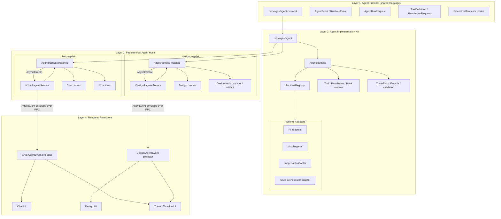
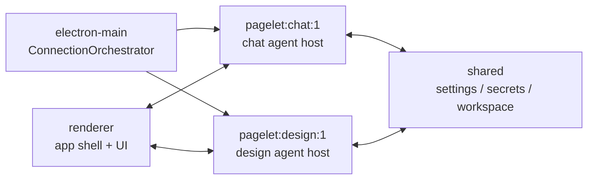

# Telegraph Agent Protocol 与跨 Pagelet Agent 架构计划

> 本计划把 `runtime-contracts` 重新定位为 Agent Protocol Layer：共享协议，不共享进程；每个 pagelet 自持 harness。`chat` 是第一消费者，`design` 是第二消费者，multi-agent 与未来 orchestrator 都通过统一事件协议投影。

## Summary

将当前 `runtime-contracts` 升级为 **Agent Protocol Layer**，作为 Telegraph 内 `chat`、未来 `design` 等 pagelet 共享的 agent 协议中轴；在 `packages/agent` 内建设 pagelet-local harness，支撑 single agent、multi-agent、tools、trace、extension、未来 orchestrator adapter。

核心原则：**共享协议，不共享进程；每个 pagelet 自持 harness。**

## Architecture

## Key Decisions

- 长期包名采用 `@telegraph/agent-protocol`，目录为 `packages/agent-protocol`。
- `RuntimeEvent` 短期保留，新增别名 `AgentEvent = RuntimeEvent`；新代码优先使用 `AgentEvent`。
- 已删除临时兼容 re-export：`@telegraph/runtime-contracts`；活跃代码只使用 `@/packages/agent-protocol`。
- `agent-protocol` 只包含协议：events、run request、messages、tools metadata、extensions manifest、permissions、hooks、fixtures、compat docs。
- `packages/agent` 承载实现：harness、runtime adapters、tool execution、permission broker、trace sink、orchestration adapters。
- `chat` 和 `design` 都在各自 pagelet 内运行 harness；main/shared/daemon 不 import runtime 实现。

## Implementation Changes

- **Agent Protocol**：迁移 `runtime-contracts` 为 `agent-protocol`，增加 `AgentRunRequest`、`AgentRunEventEnvelope`，将 `AbortSignal` 等执行态能力留在 harness 层，并补齐 single LLM、tool call、multi-agent、design artifact fixtures。
- **Pagelet Agent Harness**：在 `packages/agent` 新增 `createAgentHarness()`，负责 runtime selection、run lifecycle、cancel、event validation、non-blocking trace、tool/permission/hook 调度。
- **Chat First Consumer**：`chat` 主链路改为 `AgentEvent-first`，旧 `text_delta` / `llm_trace` 只作为兼容桥；UI projector 负责 `AgentEvent → chat messages / tool cards / run status / trace rows`。
- **Design Second Consumer**：`design` 后续接同一 harness，但不复用 chat 状态模型；design 结果先通过 `assistant_message`、`tool_result.output`、`run_completed.output` 或 metadata 承载。
- **Multi-Agent 与 Orchestrator**：第一版 multi-agent 用现有 `pi-subagents` 打通 chain/parallel；`/langgraphjs/libs/orchestrator` 未来作为 `TelegraphOrchestratorRuntime` adapter 引入，不成为协议层。

## Execution Status

- [x] 建立 `packages/agent-protocol`，并在迁移完成后删除 `packages/runtime-contracts` 兼容 re-export。
- [x] 新增 `AgentEvent` alias、`AgentRunRequest`、`AgentRunEventEnvelope` 与 multi-agent/design fixtures。
- [x] 新增 `agent-protocol` golden fixture compatibility tests，确保 schema v1、已知事件类型、JSON 可序列化与完整 run terminal event。
- [x] 新增 `packages/agent` pagelet-local `AgentHarness`、runtime registry、terminal event fallback、non-blocking trace sink。
- [x] 将 chat 主链路改为 `AgentEvent-first`，并保留 legacy projection 兼容桥。
- [x] 将 chat trace panel 升级为 root run / child run / step timeline。
- [x] 为 chat projector、chat timeline、agent harness 增加 focused tests。
- [x] 为 design 增加独立 `AgentEvent → design projection` 纯函数与 design-ready tests，验证不依赖 chat message shape。
- [x] 将 design pagelet node host 接入 pagelet-local harness，并通过 `metadata.designContext` 预留 design-local context/tools 注入点。
- [x] 将 design renderer 接入 `IDesignPageletService` agent RPC，`DesignWorkspace` 可发起 pagelet-local agent run 并投影 assistant text / artifact。
- [x] chat/design renderer agent service 支持 abort-aware pagelet readiness wait、RPC cancel 和 listener cleanup，避免后台 run/listener 泄漏。
- [x] 将 abort-aware pagelet readiness wait 收束为 `packages/services/pagelet-host/browser/pagelet-ready`，并补 retry/timeout/abort tests。
- [x] chat projector 支持 `tool_result` / `tool_error` 更新 tool card，避免 tool UI 长期停留在 running。
- [x] 将 runtime settings storage 迁移到 `packages/agent/browser/runtime-settings-storage`，chat/design 共享 `telegraph.agent.modelSettings` 并兼容旧 chat key。
- [x] design workspace 增加运行中停止按钮，显式 abort pagelet-local agent runs。
- [x] 补 chat/design pagelet agent service abort/cancel tests，并将 tool call upsert 抽成可测纯函数。
- [x] 补 chat/design pagelet agent service successful `AgentEvent` projection tests，覆盖 renderer service 的完成态 listener cleanup。
- [x] `pagelet-ready` helper 补 already-aborted timeout signal 测试。
- [x] chat/design pagelet worker 在 cancel 分支补 `run_cancelled` AgentEvent envelope，避免取消只落到 legacy `run_failed`。
- [x] design renderer 将取消态与失败态区分为 `cancelled`，停止按钮不再把 `Cancelled` 当作 assistant 错误文本追加。
- [x] `apps/main` renderer Vite alias 补 `@/packages/agent`，保证 chat/design browser 侧共享 runtime settings helper 可被实际打包解析。
- [x] `AgentHarness` 增加轻量 hook runtime：`beforeRun`、`onRuntimeEvent`、`afterRun` 非阻塞调度，为 extension/orchestrator observability 预留稳定插槽。
- [x] 修复 chat/design renderer event subscription cleanup：x-oasis `on*` 返回 `Unsubscribable` 对象，renderer 改为 `subscription.unsubscribe()`，避免 assistant 回复完成后报 `unsubscribe is not a function`。
- [x] 删除 `packages/runtime-contracts` 兼容包，清理 tsconfig / Vite / Vitest / README / AGENTS / skill conventions 中的旧 alias。
- [x] 补 adapter conformance 基础设施与 mock adapter tests：required fields、terminal event、serializable raw、failure normalization。
- [x] 引入 orchestrator adapter 前补 observability hooks：node start/end、edge taken、checkpoint、interrupt；当前用 schema v1 现有事件表达，避免提前引入 Telegraph Workflow DSL。
- [x] 新增 `TelegraphOrchestratorRuntime` 注入式 adapter 骨架，为 `/langgraphjs/libs/orchestrator` 预留接入点但不直接绑定外部实现。
- [x] 新增 pagelet runtime boundary test，防止 main/shared/daemon/services 源码 import runtime implementation。

## Test Plan

- `agent-protocol` typecheck、fixtures、schema compatibility tests。
- adapter conformance：required fields、terminal event、serializable raw、run failure normalization。
- harness tests：runtime selection、cancel、trace sink failure 不阻塞主流、permission/tool hook 调度。
- chat projector tests：assistant delta、tool call/result、run failure、child run timeline。
- design-ready projector tests：模拟 design artifact output，验证不依赖 chat message shape。
- architecture check：runtime/harness 只在 pagelet 内运行，main/shared/daemon 不导入 runtime implementation。

## Assumptions

- 最终命名采用 `agent-protocol`，`runtime-contracts` 过渡兼容包已删除。
- 每个 pagelet 自持 harness，是长期架构默认。
- 第一阶段不做 Telegraph Workflow DSL。
- Multi-agent 的第一产品切片先服务 chat；design 接入以协议可移植性验证为目标。
