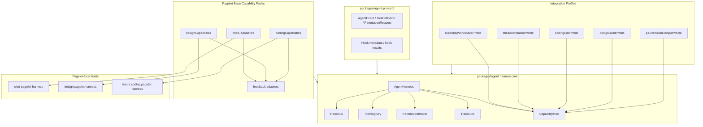

# Harness Capability 与 Extension 分层执行计划

> 本计划沉淀关于 Pi extension、coding agent 能力、chat/design pagelet 边界的设计结论：Telegraph harness 要支持 extension，但不能把 Pi coding-agent extension 作为所有 pagelet 默认能力。正确方向是先建立 Harness Capability + Integration Model，再把 Pi extensions 放进 coding capability pack 或显式启用的 compatibility profile。

## 背景

Pi extension 示例（inline bash）体现的是 coding agent host 能力：在用户输入进入模型前拦截 prompt，执行 shell，把 `!{command}` 替换为命令输出，并通过 UI notify 告知用户。这类能力默认假设存在 workspace、shell、filesystem、patch、terminal/coding UI feedback。

但 Telegraph 的 `chat` 与 `design` 并不天然等于 coding agent；pagelet 身份也不等于权限边界：

- `chat` 可能只需要轻量 prompt preprocess、模型选择、通用 tools、trace。
- `design` 更需要 canvas context、artifact/component generation、patch preview、design action feedback。
- `coding` 默认围绕 workspace、repo status、patch apply、terminal feedback 等能力组织，因此最自然承载 Pi extension compatibility。

同时，`chat` 或 `design` 都可能在某次任务中需要读文件、执行命令、修改项目文件。这个需求不应该通过“把 chat/design 变成 coding agent”来解决，而应该通过按 run/session 启用的 integration profile 解决：默认不授予高风险能力，但当用户意图、workspace policy 与 PermissionBroker 都允许时，pagelet-local harness 可以临时挂载 shell/filesystem/patch integration。

因此 extension 不能作为“所有 harness 默认启用”的全局能力；它必须被拆成可组合 capability pack 与 integration profile，由 pagelet-local harness 按产品场景和单次任务显式选择。

## 核心决策

- `packages/agent-protocol` 只定义可序列化协议事实：`AgentEvent`、`ToolDefinition`、`PermissionRequest`、extension metadata、hook result 类型。
- `packages/agent` 提供 harness core：`AgentHarness`、`RuntimeRegistry`、`HookBus`、`ToolRegistry`、`PermissionBroker`、`TraceSink`、`CapabilityHost`。
- Pi extension compatibility 不进入 harness core；它属于 `codingCapabilities()` 或显式启用的 `piExtensionCompatProfile()`。
- `ctx.ui` 不作为核心 API；抽象为 `ctx.feedback`，由不同 pagelet 适配到 chat note、design activity、coding terminal/toast 或 headless trace。
- `chatCapabilities()`、`designCapabilities()`、`codingCapabilities()` 分开注册，默认互不继承。
- Shell、filesystem、patch 更准确地说是 integration capability：它们可以被 chat/design/coding 任一 pagelet 请求，但必须经由 task profile + PermissionBroker 授权。
- Pagelet base capability 定义“这个页面天然会提供什么上下文和反馈方式”；integration profile 定义“这次任务临时需要接入哪些外部系统”。

## Target Architecture



## Pi Inline Bash 示例映射

Pi extension 原始能力：

```typescript
pi.on("input", async (event, ctx) => {
  const bashResult = await pi.exec("bash", ["-c", command], { timeout: 30000 })
  ctx.ui.notify("Expanded ...", "info")
  return { action: "transform", text: result, images: event.images }
})
```

Telegraph 内部应映射为：

```typescript
hookBus.on("input", async (event, ctx) => {
  const result = await ctx.capabilities.process.exec("bash", ["-c", command], {
    timeoutMs: 30000,
    permission: { type: "shell", risk: "medium" },
  })

  ctx.feedback.notify({ level: "info", message: "Expanded inline commands" })
  return { action: "transform", text: nextText, images: event.images }
})
```

关键点：

- `pi.exec` 映射为受控 capability，不是裸 `child_process`。
- `ctx.ui.notify` 映射为 `feedback.notify`，由 pagelet 决定 UI 表达。
- prompt transform、shell exec、notify 都进入 trace / `AgentEvent`，方便 debug。

## API Design

### Harness 创建

```typescript
createAgentHarness({
  runtimeRegistry,
  capabilities: [
    chatCapabilities(),
  ],
})

createAgentHarness({
  runtimeRegistry,
  capabilities: [
    designCapabilities(),
  ],
})

createAgentHarness({
  runtimeRegistry,
  capabilities: [
    codingCapabilities(),
    piExtensionCompatProfile(),
  ],
})
```

### Task Capability Profile

```typescript
type TaskCapabilityProfile =
  | { kind: "default" }
  | { kind: "readonly-workspace"; scopes: string[] }
  | { kind: "shell-automation"; commands?: string[]; cwdPolicy: "workspace" | "restricted" }
  | { kind: "coding-edit"; scopes: string[]; patchPolicy: "preview" | "apply-after-confirm" }
  | { kind: "design-build"; scopes: string[]; artifactPolicy: "preview" | "apply-after-confirm" }
  | { kind: "pi-extension-compat"; extensionIds: string[] }

createAgentHarness({
  runtimeRegistry,
  capabilities: [
    chatCapabilities(),
    readonlyWorkspaceProfile({ scopes: ["repo:read"] }),
  ],
})

createAgentHarness({
  runtimeRegistry,
  capabilities: [
    designCapabilities(),
    designBuildProfile({ scopes: ["artifact:write", "repo:read"] }),
  ],
})
```

Profile 的选择可以来自用户显式请求、命令 palette、run request metadata 或 pagelet policy。无论入口是什么，高风险动作都仍需走 `PermissionBroker`。

### Hook Result

```typescript
type InputHookResult =
  | { action: "continue" }
  | { action: "transform"; text: string; images?: unknown[] }
  | { action: "block"; reason: string }
```

### Feedback API

```typescript
interface FeedbackAPI {
  notify(input: { level: "info" | "warn" | "error"; message: string; raw?: unknown }): void | Promise<void>
  progress?(input: { message: string; current?: number; total?: number }): void | Promise<void>
  confirm?(input: { title: string; message: string }): Promise<boolean>
}
```

### Process Capability

```typescript
interface ProcessCapability {
  exec(
    command: string,
    args: string[],
    options: {
      timeoutMs?: number
      permission: { type: "shell"; risk: "low" | "medium" | "high" }
    },
  ): Promise<{ stdout: string; stderr: string; code: number | null }>
}
```

## Capability 与 Integration 分层

| Layer | 代表项 | 默认语义 | 可按 profile 升权 | 禁止默认 |
|------|--------|----------|-------------------|----------|
| Pagelet base capability | `chatCapabilities()` | prompt preprocess、轻量 feedback、chat-local tools、chat context | 可启用 readonly workspace、shell automation、coding edit，但必须有 run profile 与 permission | Pi extension compat、隐式 shell、隐式 filesystem write |
| Pagelet base capability | `designCapabilities()` | canvas context、artifact tools、preview/apply design patch、design feedback | 可启用 readonly workspace、design build、shell automation、artifact patch，但必须有 run profile 与 permission | Pi UI coupling、隐式 repo patch |
| Pagelet/mode base capability | `codingCapabilities()` | workspace context、terminal feedback、repo-aware tools、diff/patch workflow | 可启用 Pi compat、shell、filesystem、patch apply | design canvas 状态模型 |
| Integration profile | `readonlyWorkspaceProfile()` | 读取 workspace/repo 内容 | 由 host policy 限定 scope | filesystem write |
| Integration profile | `shellAutomationProfile()` | 运行受控 shell command | command allowlist、cwd/env allowlist、timeout、permission | 裸 `child_process` |
| Integration profile | `codingEditProfile()` | 文件写入、patch preview/apply | scopes、diff preview、apply confirmation | 静默写入 |
| Compatibility profile | `piExtensionCompatProfile()` | `pi.on`、`pi.exec`、`ctx.hasUI`、`ctx.ui.notify` adapter | coding mode 或用户显式启用 | 所有 harness 默认启用 |

这里可以把 shell/filesystem/patch/Pi compat 理解为 integration：它们把外部系统或外部生态接进 Telegraph harness。但它们不是协议层，也不是 pagelet 的天然身份。`AgentEvent` 只负责把结果、权限、trace 表达成可序列化事实；integration adapter 负责执行和安全边界。

## Implementation Plan

### Phase 0：协议与边界收束

- [x] 将 `packages/agent-protocol/src/hooks.ts` 从字符串 hook 扩展为 typed hook payload/result。
- [x] 在 `packages/agent-protocol` 中补 `InputHookEvent`、`InputHookResult`、`FeedbackEvent` 的可序列化类型。
- [x] 保持协议层不出现 Pi 专有类型；Pi 只出现在 adapter metadata/raw 中。

### Phase 1：Harness Core Capability Model

- [x] 新增 `CapabilityHost`，负责注册 process/filesystem/feedback/tool/hook capability。
- [x] 新增 `TaskCapabilityProfile`，把 pagelet base capability 与 run/session 级 integration 拆开。
- [x] 新增 typed `HookBus`，支持顺序执行 input transforms。
- [x] 将 `AgentHarness.run()` 的 message 构造前置到 input hook pipeline。
- [x] input hook 支持 `continue`、`transform`、`block`。
- [x] 所有 hook failure normalize 为 `run_failed` 或 `runtime_log`，不得让 trace 阻塞主流。

### Phase 2：Permission 与 Trace

- [x] 新增 `PermissionBroker` MVP，先支持 shell/filesystem/network 三类 request。
- [x] `process.exec` 必须带 permission、timeout、cwd、env allowlist。
- [x] shell/filesystem capability emit `tool_call` / `tool_result` / `tool_error` 或 `runtime_log`。
- [x] feedback notify emit `runtime_log`，UI 可以投影但业务不依赖 UI ack。
- [x] PermissionBroker 根据 pagelet、run profile、用户意图、workspace policy、risk level 综合判定 grant/deny。

### Phase 3：Pagelet Capability Packs

- [x] 实现 `chatCapabilities()`，只启用轻量 input hooks 与 chat feedback adapter。
- [x] 实现 `designCapabilities()`，注入 canvas/artifact context 和 design feedback adapter。
- [x] 实现 `codingCapabilities()`，注入 workspace、shell、filesystem、patch apply、coding feedback adapter。
- [x] chat/design base pack 默认不启用 shell/filesystem write/Pi compat，但允许通过 explicit task profile 临时启用 shell/filesystem/patch integration。

### Phase 4：Pi Extension Compatibility

- [x] 实现 `PiExtensionCompatHost`，提供伪 `ExtensionAPI`：`pi.on`、`pi.exec`、必要 `ctx`。
- [x] 首个兼容测试跑通 inline bash extension。
- [x] `ctx.hasUI` 根据当前 feedback adapter 决定。
- [x] `ctx.ui.notify` 映射到 `ctx.feedback.notify`。
- [x] 不支持的 Pi API 明确返回 unsupported error，并进入 trace。

### Phase 5：Product Wiring

- [x] 为 future coding pagelet 或 coding mode 启用 `codingCapabilities() + piExtensionCompatProfile()`。（2026-05-19 已通过 run-scoped `createPageletRunCapabilities()` 接入 chat/design pagelet：默认 profile 轻量，只有 explicit `shell-automation` / `coding-edit` / `design-build` 才按 run 注入 process/filesystem/patch/Pi compat，权限不跨 run 泄漏）
- [x] chat/design 设置页暴露“按任务请求 workspace/shell/edit 能力”的安全策略，不暴露默认 Pi extension 开关。（2026-05-19 chat settings 已持久化 run 级 task capability profile 与 orchestrator 实验入口；design UI 已接入共享 runtime settings；高风险 integration 仍不默认启用）
- [x] Trace panel 按 run 展示 extension hook、permission、exec、feedback。（2026-05-19 LLM Trace timeline 增加 permission/tool-exec/runtime feedback/hook 摘要；Pi compat input hook 会发非阻塞 feedback runtime_log）
- [x] 增加 architecture boundary test：main/shared/daemon 不 import extension runtime implementation。（2026-05-19 boundary test 扩展到 static import、side-effect import、dynamic import、require）

### Phase 6：Design Artifact Preview / Apply Loop

- [x] 将 design agent 产物从 JSON 卡片升级为 artifact workbench，支持产物列表、当前产物保活选择、预览/源码切换。
- [x] HTML 产物使用 sandbox iframe 预览；code/source/tsx/jsx/content 产物使用源码视图；operations 产物投影为 patch summary。
- [x] “应用”动作不静默写文件，而是发起新的 design run，请求模型基于指定 artifact 进入 apply/patch 流程，继续受 run profile 与 permission 约束。
- [x] 增加 view-model 单测和 DOM 交互测试，覆盖 HTML 预览、patch 统计、模式切换、应用回调与已请求禁用态。

### Phase 7：Design Patch Preview / Confirm / Apply

- [x] 在 design pagelet RPC contract 上新增 artifact patch preview/apply 方法，renderer 仍只通过现有 pagelet service client 访问，不引入裸 IPC。
- [x] Patch preview 在 design utility process 内使用 `PermissionedNodePatchCapability.preview()` 做路径归一与 allowedRoots 校验，renderer 只消费序列化结果。
- [x] Patch apply 必须满足 `design-build + artifactPolicy: apply-after-confirm + repo:write`，并通过 `PermissionBroker` 记录 permission/tool trace；默认 profile 仍不能静默写入。
- [x] Workbench patch 产物进入两步动作：先“预览 Patch”，显示 normalized operations；再“确认应用”，应用成功后进入已应用态。
- [x] Design 设置页在用户开启 artifact apply after confirmation 时自动补 `repo:write` scope，避免 UI 策略与 PermissionBroker 写入要求脱节。
- [x] Patch add 操作支持自动创建父目录，结构化 patch 能覆盖新增嵌套文件。

## Test Plan

- HookBus tests：多个 input transform 顺序执行、block 中断、hook failure normalize。
- CapabilityHost tests：capability registration、缺失 capability 报错、pagelet pack 隔离。
- TaskCapabilityProfile tests：chat/design 默认轻量；按 run profile 启用 readonly/shell/edit；profile 结束后 capability 不泄漏到下一次 run。
- PermissionBroker tests：shell permission denied/approved、timeout、error normalization。
- Pi compat tests：inline bash extension transform、`ctx.ui.notify` 映射、unsupported API trace。
- Chat/design tests：默认没有 shell/filesystem/Pi extension capability；带 explicit profile 时可以请求 shell/filesystem/patch，并被 PermissionBroker 正确约束。
- Design artifact tests：HTML/code/patch view-model 投影正确；workbench 交互能选择产物、切换模式、请求应用且避免重复请求。
- Design patch apply tests：pagelet browser service 传递保存后的 run profile；Node patch capability 支持嵌套新增文件并保留权限事件序列。
- Coding pack tests：coding mode 默认具备 workspace-aware edit workflow，但 shell/patch apply 仍受 permission policy 约束。
- Boundary tests：协议层无 Pi 类型，main/shared/daemon 不 import runtime/extension implementation。

## Acceptance Criteria

- chat/design harness 可继续运行，不背 coding agent 权限。
- chat/design 可在明确 task profile 下执行读文件、shell command、patch preview/apply 等任务，且权限不跨 run 泄漏。
- coding pack 可运行 Pi inline-bash extension 示例。
- Pi extension 行为可观测：input transform、exec、notify 都能在 trace 中定位。
- permission 默认拒绝高风险能力，必须由 host/pagelet policy 显式允许。
- `packages/agent-protocol` 保持 framework-agnostic。

## Open Questions

- coding capability 是独立 pagelet，还是 chat 的 coding mode？
- shell/filesystem permission UI 由 main 提供全局弹窗，还是 pagelet 自己投影？
- Pi extension 的 module loading 是否允许直接执行本地 TS，还是必须先 build/签名？
- design 是否需要自己的 extension compat，还是只支持 native design capability？
