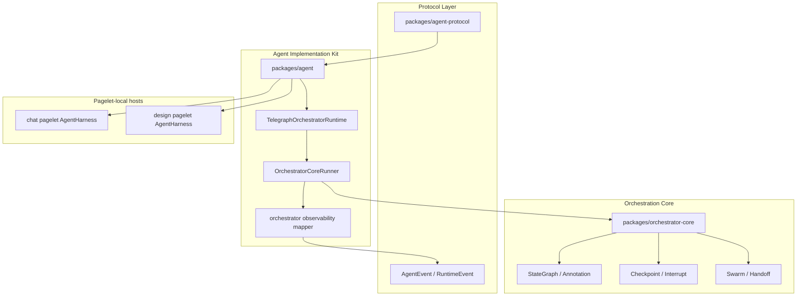

# Orchestrator Core 受控迁入与 Agent Harness 接入计划

> 本计划记录 `langgraphjs/libs/orchestrator` 迁入 Telegraph 的边界与跟进方式：可以复制源码，但必须保持包边界、协议边界和 pagelet-local harness 边界，避免 Telegraph 核心被 graph 框架锁死。

## 背景

`/Users/ryuyutyo/Documents/code/modules/ai/langgraphjs/libs/orchestrator` 本身也需要从原项目拆出。考虑到它是零依赖 TypeScript graph orchestration engine，Telegraph 可以先作为真实宿主接纳它，但迁入方式必须是 **controlled migration**，不是整目录复制。

当前 Telegraph 已完成 P-004 的 Agent Protocol / Pagelet-local Harness 第一阶段：`packages/agent-protocol` 是共享协议，`packages/agent` 是实现 kit，chat/design 各自在 pagelet 内持有 harness。Orchestrator 只能接在 implementation/adapters 层，不能进入协议层。

## 决策

- 采用 `packages/orchestrator-core` 作为迁入目标。
- 只迁入可维护内核：`src/`、`package.json`、`tsconfig.json`、`vitest.config.ts`、README、必要测试与 license。
- 不迁入构建产物和环境产物：`dist/`、`node_modules/`、`playground/dist/`。
- `examples/` 可以迁入，但必须标记为示例资产；不得成为产品运行路径依赖。
- `packages/agent` 通过 `TelegraphOrchestratorRuntime` / runner adapter 消费 orchestrator-core。
- `packages/agent-protocol` 不依赖 orchestrator-core；协议仍只表达 `AgentEvent` / `RuntimeEvent` 事实。
- chat/design UI 不 import graph API，只消费 `AgentEvent` 投影。

## Target Architecture

## 迁入范围

### 必迁

- `src/channels/`
- `src/checkpoint/`
- `src/constants.ts`
- `src/engine/`
- `src/errors.ts`
- `src/graph/`
- `src/interrupt.ts`
- `src/runnables/`
- `src/state/`
- `src/swarm/`
- `src/index.ts`
- 与以上源码匹配的单元测试
- `package.json`、`tsconfig.json`、`vitest.config.ts`、README

### 可选迁入

- `examples/`：迁入后只作为开发参考，不作为 Telegraph app runtime 依赖。
- `playground/src/`：暂不迁入；若后续要做可视化调试器，应单独设计为 devtool/pagelet。

### 禁止迁入

- `node_modules/`
- `dist/`
- `playground/dist/`
- 外部项目的 lockfile 或缓存目录

## Implementation Plan

### Phase 0：迁入前快照

- [x] 记录来源路径、当前 package name、版本、核心导出。
- [x] 记录排除清单，确保不会复制 `node_modules` / `dist`。
- [x] 建立 `packages/orchestrator-core` package 边界。

### Phase 1：源码受控迁入

- [x] 复制 `src/` 与必要测试。
- [x] 复制 README 并改写为 Telegraph workspace 内部包说明。
- [x] 调整 package name 为 `@telegraph/orchestrator-core`。
- [x] 将 TypeScript / Vitest 配置调整到 Telegraph workspace 规范。
- [x] 确保该包不依赖 Electron、React、x-oasis、agent-protocol。

### Phase 2：Agent adapter 接入

- [x] 在 `packages/agent` 增加 `OrchestratorCoreRunner`。
- [x] 将 node start/end、edge taken、checkpoint、interrupt 映射为 `TelegraphOrchestratorSignal`。
- [x] 通过现有 `TelegraphOrchestratorRuntime` 输出 `AgentEvent`。
- [x] 增加最小 graph conformance test：linear chain、conditional edge、parallel fan-out/fan-in、interrupt/cancel。

### Phase 3：Pagelet 验证

- [x] 在 chat pagelet 增加隐藏/测试入口 runtime selection，不先暴露正式产品开关。
- [x] 用同一 `AgentEvent` projector 验证 trace timeline 可展示 orchestrator step。
- [x] 确认 main/shared/daemon 不 import `@/packages/orchestrator-core` 或 runtime implementation。

### Phase 4：产品化评估

- [ ] 决定 `orchestrator-core` 是长期留在 Telegraph monorepo，还是拆成独立 repo/package。
- [ ] 如果拆出，保留 Telegraph 侧 adapter，不让外部 package 形态影响 `agent-protocol`。
- [ ] 设计 devtool/playground 是否作为独立 pagelet 出现。

## Sustainability Criteria

这次迁入只有满足以下条件，才算可持续：

- **独立包边界**：`packages/orchestrator-core` 可以单独 typecheck/test。
- **协议无污染**：`packages/agent-protocol` 不出现 `StateGraph`、`Annotation`、`Pregel` 等实现概念。
- **运行时隔离**：orchestrator runtime 只在 pagelet harness 中运行。
- **观测优先**：graph 执行过程必须能映射为 `AgentEvent`，包括 step、edge、checkpoint、interrupt、terminal event。
- **可拆出**：未来把 `packages/orchestrator-core` 移出 Telegraph 时，Telegraph 只需要替换 package dependency，不需要改协议和 UI。

## Risks

- **Graph API 泄漏风险**：chat/design 直接 import `StateGraph` 会破坏跨 pagelet 可移植性。
- **Fork 维护风险**：如果无边界地复制整个目录，Telegraph 会承担 playground、dist、node_modules、examples 的长期维护。
- **Trace 黑盒风险**：只拿 final output 不拿 node/edge/checkpoint 信号，会让 orchestrator 成为不可调试黑盒。
- **过早 DSL 风险**：不要基于 orchestrator-core 立即定义 Telegraph Workflow DSL；第一阶段继续只抽象运行事实。

## Verification Gates

- `pnpm --filter @telegraph/orchestrator-core test`
- `pnpm --filter @telegraph/orchestrator-core typecheck`
- `pnpm exec tsc -p packages/agent/tsconfig.json --noEmit`
- focused agent runtime tests：`TelegraphOrchestratorRuntime` + `OrchestratorCoreRunner`
- architecture boundary test：main/shared/daemon/services 不 import runtime implementation 或 orchestrator-core
- Vite build：chat/design worker entry 可打包

## Follow-up Tracking

- [x] 建立 `packages/orchestrator-core`
- [x] 接入 `packages/agent` adapter
- [x] 打通最小 graph run
- [x] 打通 trace timeline
- [ ] 评估是否拆出独立 repo/package
